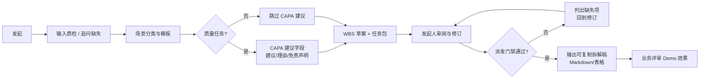
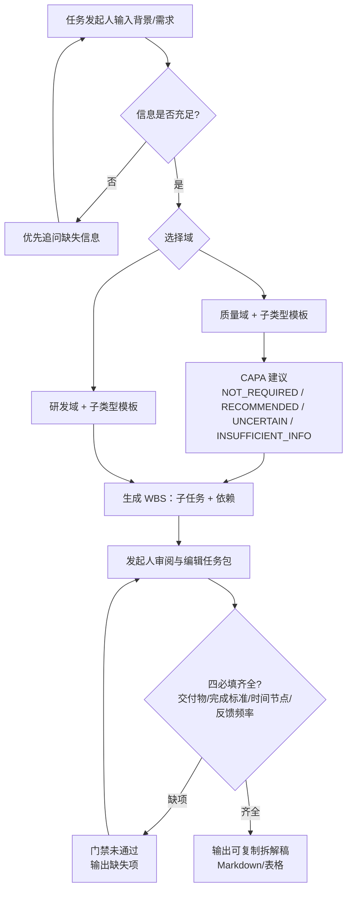
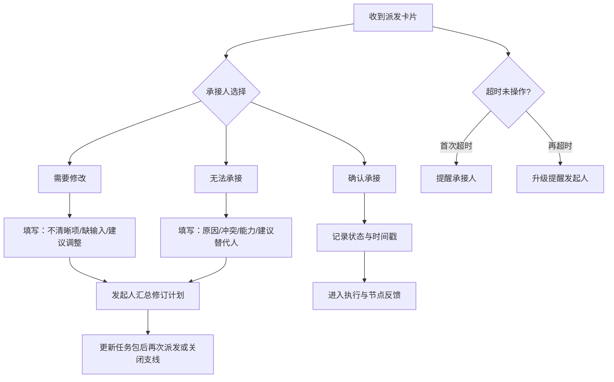
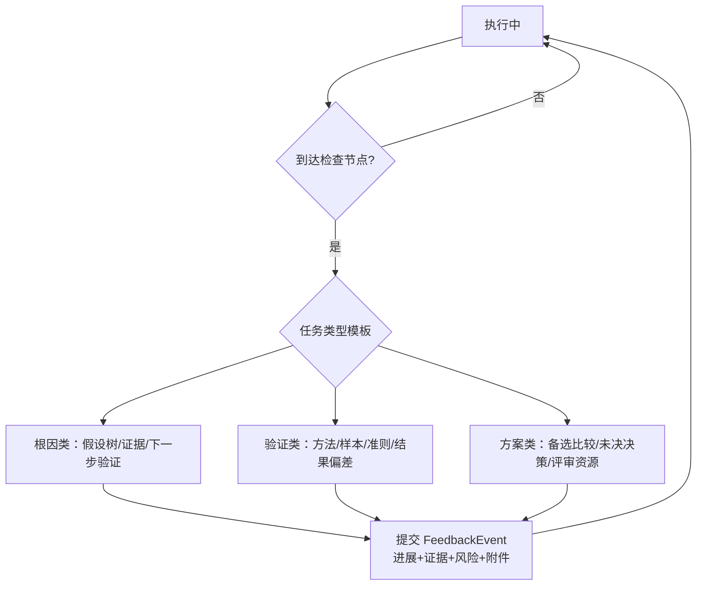
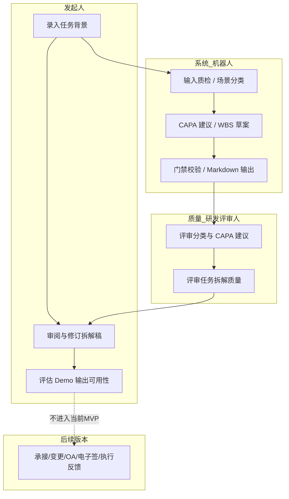
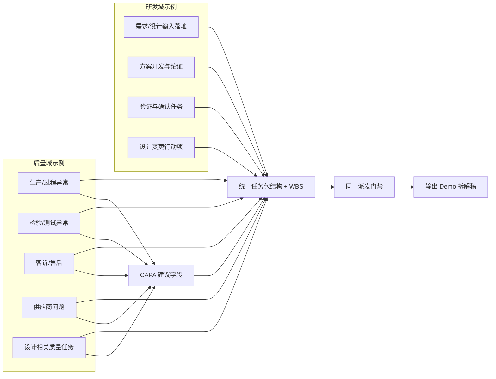

# 钉钉「任务规划与承接确认」机器人 — 场景流程图

**关联文档**：[PRD-钉钉任务规划与承接确认机器人.md](./PRD-钉钉任务规划与承接确认机器人.md)  
**用途**：开发实现边界、测试场景路径、质量/研发业务对接对齐  
**版本**：v1.1（与 PRD v1.1 对齐）

---

## 1. Demo / MVP 总览（任务拆解主链路）



---

## 2. 任务拆解生成（含输入质检、分类、CAPA 建议、门禁）



**对接说明**：MVP 只验证任务拆解效果，不进入正式派发、承接确认、OA 流程和电子签。质量 / 研发子类型与模板文案由业务确认（参见 PRD §3.2、§9）；研发模板强调「范围边界」。

---

## 3. 后续版本：强制承接确认（不进入当前 MVP）



**测试要点**：不允许「默认接受」；三态必选其一；提醒与升级策略可配置（FR-07）。

---

## 4. 后续版本：执行中节点反馈（不进入当前 MVP）



---

## 5. 后续版本：验收与可选复盘（不进入当前 MVP）

```mermaid
flowchart LR
  FEV[节点反馈累计至可验收] --> ACC{验收人判定}
  ACC -->|通过| DONE[任务完成留痕]
  ACC -->|不通过| RET[退回补充/改派]
  RET --> EXEC2[继续执行与反馈]
  EXEC2 --> ACC
  DONE --> RP[(可选) 任务定义复盘<br/>指标：一次理解/延期原因等]
```

---

## 6. Demo 角色泳道（研发对接：职责边界）



---

## 7. 质量域 vs 研发域（首期场景入口差异）



---

## 8. 功能需求与流程映射（便于排期与测试用例编号）

| 流程阶段 | 主要 FR |
| ------ | ------ |
| 场景入口 | FR-01 |
| 输入质检 | FR-02 |
| WBS 生成 | FR-03 |
| 派发门禁 | FR-04 |
| CAPA 建议 | FR-05 |
| Markdown/表格输出 | FR-06 |
| 人岗推荐 | FR-07（P1） |
| 承接三态 | FR-08（P2） |
| 任务变更 | FR-09（P2） |
| OA/电子签 | FR-10（P2） |
| 外部 Agent 链接 | FR-11（P2） |

---

## 9. 待决策项对流程的影响（评审前标灰区域）

以下 PRD §12 决策会改变实现分支，建议在详设前锁定：

1. **质量首期子类型** → 影响 FR-01 模板清单与验收案例集。  
2. **真实样本集** → 影响分类、CAPA 建议和 WBS 拆解的回归评估。  
3. **CAPA 建议评估口径** → 影响 `RECOMMENDED` / `UNCERTAIN` 的验收标准。  
4. **研发需求/风险 ID** → 任务包「追溯信息」是否必填。  
5. **后续集成优先级** → 决定 OA、电子签、任务变更、外部 Agent 链接的实施顺序。

---

**文档结束**
