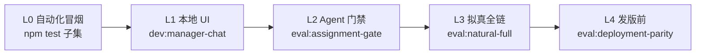

# 本地测试环境与测试方案

> 一站式本地联调指南。工作台 UI 细项见 [local-test-workbench-excel-chat-ux.md](./local-test-workbench-excel-chat-ux.md)；Agent eval 见 [eval-natural-full-plan.md](./eval-natural-full-plan.md)。

**最后更新**：2026-05-26

---

## 一、环境准备（一次性）

### 1. 前置条件

| 项 | 要求 |
|----|------|
| Node.js | **≥ 22**（`node -v`） |
| 依赖 | 项目根目录 `npm install` |
| 密钥 | 根目录 `.env`（从 `.env.example` 复制，**勿提交**） |

```powershell
cd D:\manage_robot
copy .env.example .env
# 用编辑器填入 QWEN_API_KEY（DashScope）
```

### 2. 本地最小 `.env`（工作台 + 编排）

| 变量 | 必填 | 说明 |
|------|------|------|
| `QWEN_API_KEY` | **对话/Excel Agent/ eval 必填** | 不配可测静态 UI、改派搜索、历史任务列表 |
| `ASSIGNMENT_PHASE_ENABLED=1` | 建议 | `.env.example` 默认已开 |
| `ASSIGNMENT_WEB_PORT` | 可选 | 默认 `8787` |
| `WORKBENCH_TEST_LOGIN_ENABLED` | 本地自动 `1` | 由 `dev:manager-chat` 注入 |

**勿在本地开启**（脚本已默认关闭）：`WORKBENCH_DINGTALK_NOTIFY_ENABLED`、`FOLLOWUP_REMINDER_ENABLED`、`PROGRESS_DIGEST_ENABLED`——避免误发钉钉通知。

### 3. Portfolio / 项目（角色 A）

- **`npm run dev:manager-chat`** 已默认将 `manager-local-dev` 加入 `WORKBENCH_PROJECT_PORTFOLIO_USER_IDS`，并预置 2 个项目 + 未归类任务（见 `seedPortfolioDemo`）。
- 现网未开 portfolio 时仍为 **角色 B**（扁平历史任务）；手测角色 B 见 [local-test-portfolio-ux-v2-manual.md](./local-test-portfolio-ux-v2-manual.md) P0-7。
- **手动测试清单**：[local-test-portfolio-ux-v2-manual.md](./local-test-portfolio-ux-v2-manual.md)（Portfolio UX v2 + 按钮防重复）。

### 4. 钉钉 Stream（可选，非本地 UI 必需）

完整钉钉机器人需额外配置 `DINGTALK_CLIENT_ID`、`DINGTALK_CLIENT_SECRET` 等，见 [deploy-aliyun-dingtalk.md](./deploy-aliyun-dingtalk.md)。本地 UI 联调 **不需要** Stream。

---

## 二、启动本地服务

### 推荐：主管工作台 + 智能助手（无钉钉）

```powershell
npm run dev:manager-chat
```

| 行为 | 说明 |
|------|------|
| 数据目录 | `data/local-manager-chat-dev/`（**默认每次启动清空**） |
| 保留数据 | `npm run dev:manager-chat:keep` |
| 预置账号 | `manager-local-dev`（已并入主管白名单） |
| 预置草案 | 主线程 5 条子任务，2 条历史消息 |

**入口**

| URL | 用途 |
|-----|------|
| http://127.0.0.1:8787/workbench | 测试登录 |
| http://127.0.0.1:8787/workbench/manager/chat?thread=main | 智能规划助手 |
| http://127.0.0.1:8787/workbench/manager/projects | 项目总览（Portfolio 角色 A） |
| http://127.0.0.1:8787/workbench/manager/tasks | 历史任务（默认按项目归档） |
| http://127.0.0.1:8787/workbench/manager/tasks?view=flat | 扁平列表 |
| http://127.0.0.1:8787/health | 探活 → `ok` |

端口占用时：

```powershell
$env:ASSIGNMENT_WEB_PORT=8788; npm run dev:manager-chat
```

### 其它本地脚本

| 命令 | 用途 |
|------|------|
| `npm run dev:external-workbench` | 外部执行人登录页 |
| `npm run demo` | CLI 单轮规划 demo（需 QWEN） |
| `npm run dingtalk-bot` | 钉钉 Stream（需钉钉凭证 + 单实例） |

---

## 三、测试方案总览



按改动类型选层，不必每次都跑 L4。

---

## 四、L0 — 自动化（改代码后 2–5 分钟）

### 4.1 快速冒烟（工作台相关）

```powershell
npm run build:workbench-draft-grid
npm run lint:inline-pages
npx vitest run tests/web/workbench-contact-combo.test.ts tests/web/draft-excel-grid.test.ts tests/web/manager-conversation-side-thread.test.ts tests/infra/conversation-present.test.ts
```

### 4.2 全量单测

```powershell
npm test
npm run typecheck
```

> 注意：若 `.env` 含 ECS 级 `UPDATE_DRAFT_TASK_PER_ORCHESTRATOR_MAX=12` 等，个别单测可能与默认断言不一致；CI/发版 eval 脚本会单独 `applyEvalProductionParityEnv()`。

---

## 五、L1 — 本地 UI / 业务冒烟（15–45 分钟）

**清单**： [local-test-workbench-excel-chat-ux.md](./local-test-workbench-excel-chat-ux.md)（C/E/R 表 + 记录模板）。

**建议顺序**

1. **登录** L1–L3：`manager-local-dev` → 智能助手主线程  
2. **无 API** C1–C7、E1–E6、**历史任务页**（打开 `/workbench/manager/tasks`，确认列表加载、控制台无 `WB_PORTFOLIO` 报错）  
3. **有 API** 配置 `QWEN_API_KEY` 后重启 → C9–C13、E7–E8、发送一条「把 task_3 截止改到 6-20」  
4. **改派** R1–R3：输入「王」触发 1 字搜索  

**发布链本地手测（需 QWEN）**

1. 主线程：「请生成发布预览」→ 应 `prepare_publish_task`  
2. 「确认发布」→ `publish_task`，历史任务出现新单  
3. 员工视角：`userId` 选预置联系人（如 `u_lisi`）登录员工工作台验收承接（若已实现页面）

---

## 六、L2 — Agent 能力门禁（约 10–20 分钟，需 QWEN）

对齐现网 iteration/tool 预算（脚本内 parity）：

```powershell
npm run eval:assignment-gate
```

覆盖：花名册点将、`bulk_assign_tasks`、拆条后改派、序数 patch。

---

## 七、L3 — 拟真多轮对话（约 15–25 分钟，需 QWEN）

最接近真实用户话术与场景：

```powershell
npm run eval:natural-full
```

或单链复跑：

```powershell
$env:EVAL_NATURAL_FILTER="chain_transport"
npm run eval:natural-full
```

结果：`/.eval-natural-full/eval-summary.json`（28 turn，门禁通常要求 **28/28** 或接受 27/28 后复跑失败链）。

**其它专项 eval**

| 命令 | 场景 |
|------|------|
| `npm run eval:publish-short` | 口语「确认发布/发布吧/可以了」 |
| `npm run eval:cross-channel` | 钉钉会话 ↔ 工作台 Excel ↔ 发布 |
| `npm run eval:wbs-manager` | 主管 WBS 拆解 → 点将 → 发布 |
| `npm run eval:portfolio-suite` | 大项目 A + 角色 B 回归 |

---

## 八、L4 — 发版前部署 parity（约 30–40 分钟，需 QWEN）

```powershell
npm run eval:deployment-parity
```

汇总：`/.eval-deployment-parity/eval-summary.json`  

**关键通过条件**：`assignment-gate` **且** `natural-full` 均成功（其余阶段失败可能 exit 0 但会记在 summary）。

---

## 九、按改动类型的推荐组合

| 改动范围 | 最少跑 | 发版前建议加跑 |
|----------|--------|----------------|
| 仅工作台 CSS/JS | L0 快速冒烟 + L1 相关 C/E/R | — |
| `manager-workbench-pages` / 任务列表 | L0 + L1 **历史任务页** + R1 | `eval:cross-channel` |
| orchestrator / prompt / tools | L0 + L2 | L3 或 L4 |
| portfolio 大项目 | L0 + `eval:portfolio-suite` | L4 |
| 热修 `WB_PORTFOLIO` | L1 打开 `/manager/tasks` | — |

---

## 十、常见问题

| 现象 | 处理 |
|------|------|
| `QWEN_API_KEY` 未配置 | `.env` 填入后 **重启** `dev:manager-chat` |
| 8787 端口占用 | 换 `ASSIGNMENT_WEB_PORT` 或结束旧 node 进程 |
| 表格编辑器未加载 | `npm run build:workbench-draft-grid` |
| 不在主管白名单 | 必须用 `npm run dev:manager-chat` 启动（会注入 `manager-local-dev`） |
| `WB_PORTFOLIO is not defined` | 拉取含 `71feebe0` 的代码并重启 dev |
| eval 与单测冲突 | 发版 eval 用 `eval:deployment-parity`；单测用默认 vitest setup |

---

## 十一、相关文档

- [Qwen-接入实施说明.md](./Qwen-接入实施说明.md)
- [deploy-aliyun-dingtalk.md](./deploy-aliyun-dingtalk.md)
- [已知遗留问题-backlog.md](./已知遗留问题-backlog.md)
- [AGENTS.md](../AGENTS.md) — 现网架构与 eval 脚本索引
