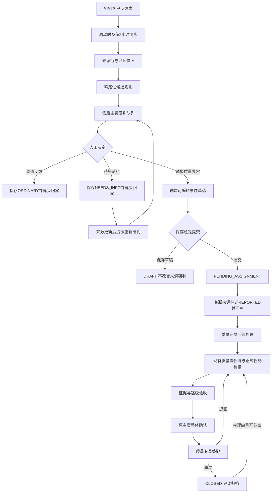
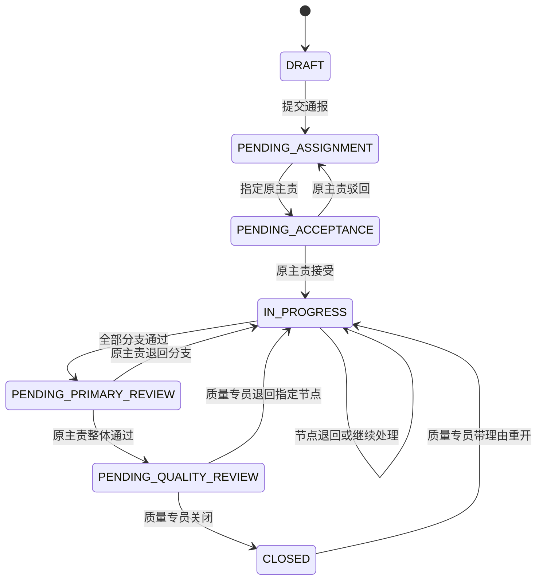

# 质量追踪流程与角色

## 1. 术语

- **来源反馈**：钉钉表格中的一行客户问题记录，对应 `quality_source_rows`。
- **研判**：售后主管对来源反馈作普通、待补资料或通报的人工决定。
- **质量事件**：正式进入质量流程后的协作记录，对应 `quality_events`。
- **异常候选**：确定性规则识别出的风险或数据不完整信号，不等于质量事件。
- **原主责（Owner）**：质量责任树根节点的承接人；当前事件通过 `primaryNodeId` 指向根节点，而不是单独保存 `owner_user_id`。
- **质量节点**：质量责任树中的一个责任节点，对应 `quality_assignment_nodes`。
- **正式任务桥接**：质量节点使用 `quality-node:{nodeId}` 连接现有任务/子任务。
- **质量意见**：配置下级和质量专员之间的事件级私密会话，不属于正式验收意见。

## 2. 角色与权限

### 售后主管 `aftersales_manager`

- 可访问反馈研判工作台和质量追踪主工作台。
- 可人工同步来源、查看趋势与证据、保存研判、创建和提交质量事件。
- 只查看本人通报事件的公开链路。
- 不负责质量终验，也不能绕过私密质量意见权限。

### 质量专员 `quality_specialist`

- 可访问质量追踪主工作台并查看全部已通报事件。
- 负责质量初步分析、责任方向判断、总期限、质量审核、指定节点退回、关闭和重开。
- 可查看完整公开链路和通知错误详情。
- 当前页面对“派发前初步分析”的结构化表达仍不充分。

### 质量意见人员 `quality_report`

- 属于员工体系，但质量意见权限由 `QUALITY_SPECIALIST_REPORTS_FILE` 独立配置。
- 只能进入质量意见页，查看与对应质量专员建立的私密会话。

### 原主责、协同主管和执行人

- 原主责可看整棵责任树并负责整体确认。
- 协同主管只看自己的分支；只有主管节点可继续向下分配。
- 执行人只看自己的节点，负责进度、证据和完成提交。
- 当前承接和执行复用原任务工作台；本基线不设计新的智能派分方式。

## 3. 当前端到端流程

## 4. 研判状态

### `UNREVIEWED`

没有 `quality_source_reviews` 记录。进入“待判断”，可选择三种人工动作。

### `ORDINARY`

人工确认不进入质量流程。保存研判、版本和审计，异步回写“普通反馈”。后续仍可在未通报前重新研判。

### `NEEDS_INFO`

当前事实不足。保存所需信息备注并回写“待补资料”；来源内容哈希变化时显示“资料已更新”，重新进入人工判断。

### `REPORTED`

只由质量事件提交成功时产生，关联 `eventId` 并回写“已进入后续流程”。研判页只能跳转查看事件，不能撤回。

## 5. 质量事件状态机

页面中文状态口径：

- `DRAFT`：草稿。
- `PENDING_ASSIGNMENT`：待分配。
- `PENDING_ACCEPTANCE`：待原主责承接。
- `IN_PROGRESS`：处理中。
- `PENDING_PRIMARY_REVIEW`：待原主责确认。
- `PENDING_QUALITY_REVIEW`：待质量终验。
- `CLOSED`：已关闭。

## 6. 证据和审核规则

- 叶子节点必须至少上传一份证据后才能提交完成。
- 证据包含版本、文件摘要、上传人、存储键、MIME、大小和 SHA-256。
- 直接上级审核子节点，可通过或带理由退回。
- 退回后保留旧证据版本和旧审核记录。
- 全部分支通过后进入原主责整体确认。
- 原主责可退回具体分支；整体通过后进入质量终验。
- 质量专员终验可退回指定节点；受影响的已审核上游节点重新打开，其他有效分支保持不变。
- 关闭和重开都必须形成公开审计。

## 7. 来源事实、业务记录和私密内容边界

### 来源事实层

`quality_source_rows.raw_snapshot_json` 保存同步得到的原始字段；页面只读展示。事件关联时再次保存不可变来源快照。

### 正式质量记录层

事件草稿、补充、更正、文件、责任节点、证据、审核、关闭和重开都属于正式公开链路，并受服务端权限和审计约束。

### 私密意见层

`quality_private_threads` 与 `quality_private_messages` 独立存储。正文不复制到公开审计、证据包、正式任务事件或通知摘要。事件关闭后只读。

## 8. 当前任务桥接边界

质量模块保存质量上下文、事件状态、责任树、证据和质量审核关系；实际承接、进度和执行继续使用原正式任务能力。每个质量节点以 `quality-node:{nodeId}` 作为确定性集成键创建任务链接，避免重复创建。

本基线只确认以下不变量：

- 质量节点和正式任务链接必须同时可追溯。
- 普通任务 JSON 与普通任务流程不能因质量模块而改变。
- 质量页聚合展示执行结果，不另造第二套执行状态。
- 未来如何智能选择 Owner、拆分任务或推荐人员，另立文档设计。

## 9. 录音需求与当前流程的关系

- `REC-89` 确认售后主管先看集中问题，再以人工判断为准决定是否向内通报。
- `REC-110` 确认质量专员不能只转发任务，派发前需要证据和初步分析。
- `REC-110` 确认技术进展和客户可读进展是不同表达，客户侧需要通俗化说明。
- `REC-110` 确认证据、阶段检查、风险预警、原主责汇总和逐级验收的重要性。
- 当前源码已实现质量事件、责任树、任务桥接、证据和逐级审核框架；阶段计划、客户可读进展和派发前初析仍有产品缺口。
