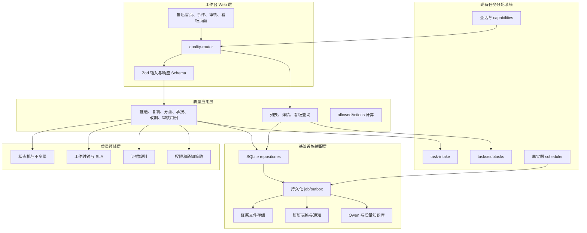
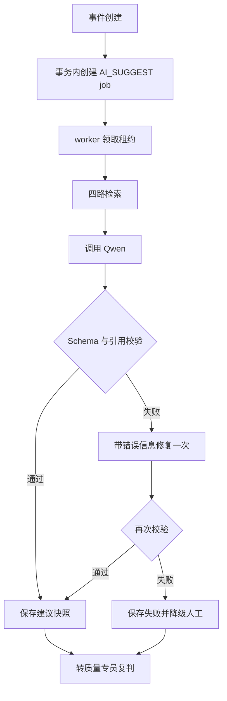
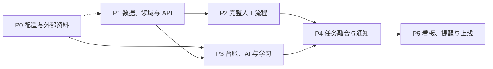

# 质量事件追踪系统 工程实施规范与分阶段开发计划 v0.2

> 文档定位：工程实施基线（回答“怎么实现、如何验证、何时算完成”）。  
> 状态：正式工程基线（用户于 2026-07-13 确认）。  
> 日期：2026-07-10。  
> 上游业务基线：`../specs/2026-07-10-quality-event-tracking-design.md`。  
> 宿主：当前 `manage_robot` 微光实例；同代码库、同进程、同 SQLite 文件新增质量模块。

---

## 0. 实施原则

1. 业务口径以 v0.2 需求文档为准，本文不得改变角色、状态、SLA、审核顺序或 AI 边界。
2. 质量模块采用模块化单体，不拆微服务。
3. `QUALITY_MODULE_ENABLED=0` 时，页面、API、调度、任务 worker 全部关闭，现有任务系统行为不变。
4. 业务写操作必须是“领域动作”，客户端不能直接修改状态。
5. 业务数据与审计同事务提交；AI、钉钉和文件等外部副作用采用持久化任务异步执行。
6. AI 只提供建议；人工流程和降级路径必须先于 AI 上线。
7. 数据库迁移只做向前兼容的增量变更。上线回滚优先关功能开关，不在事故窗口删除表或列。

## 1. 宿主工程基线

经仓库核对，当前宿主工程具备以下可复用能力：

| 能力 | 当前实现 | 质量模块使用方式 |
|---|---|---|
| 运行时 | Node.js `>=22`、TypeScript、ESM | 保持不变 |
| 数据库 | `node:sqlite` `DatabaseSync`，路径由 `src/infra/workbench-db-path.ts` 解析 | 同一 SQLite 文件新增 `quality_*` 表 |
| Web 入口 | `src/web/assignment-workbench.ts` 统一分发工作台页面/API | 只增加质量路由委托，不继续把业务逻辑堆进该文件 |
| 会话与权限 | `src/security/workbench-capabilities.ts`、主管/admin 名单机制 | 扩展 `qualityRoles` 与部门负责人能力 |
| 工作台外壳 | `src/web/workbench-shell.ts` | 增加按能力显隐的“质量追踪”菜单组 |
| 任务快录 | `src/web/task-intake-api.ts`、`src/agent/task-intake/*` | 深链预填并在 commit 后回写事件关联 |
| 文件上传 | `src/web/multipart-single-file.ts`、Busboy | 扩展为质量证据专用流式单文件适配器 |
| 调度器 | `src/agent/reminders/reminder-scheduler.ts`，由 `src/dingtalk-bot.ts` 启动 | 在同一单实例调度体系挂质量扫描 |
| 钉钉通知 | `src/integrations/dingtalk/*` | 复用发送适配器，增加持久化 outbox |
| LLM | DashScope/OpenAI 兼容、Qwen、Zod | 新建质量专用 Prompt、Schema 与检索索引 |
| 测试 | Vitest；`npm test`、`npm run typecheck` | 新增 `tests/quality/`，保持全量回归 |

### 1.1 现有限制

- 工作台路由文件已经很大，质量模块必须通过独立 router 委托，不能继续内联大量处理逻辑。
- 当前仓库未发现 `src/quality/`、`quality_events` 或 `/api/workbench/quality/` 实现，按全新模块开发。
- 当前宿主已恢复 Git 元数据；正式功能开发必须按仓库约定在 `.worktrees/` 独立分支中执行。

## 2. 总体架构

### 2.1 模块架构图



### 2.2 分层约束

- `domain` 不依赖 HTTP、SQLite、钉钉、Qwen 或环境变量。
- `application` 组织事务和用例，只通过接口访问 repository、job queue 和时钟。
- `infra` 实现 SQLite、文件、钉钉、Qwen、embedding 与配置读取。
- `web` 只做会话、输入校验、调用用例、错误映射和页面渲染。
- 现有任务系统不引用质量领域代码；质量模块通过现有公开函数或只读 repository 获取任务进度。

### 2.3 目标文件结构

```text
manage_robot/
  src/quality/
    domain/
      types.ts
      event-state-machine.ts
      event-policies.ts
      allowed-actions.ts
      work-calendar.ts
      sla-policy.ts
      evidence-policy.ts
      notification-policy.ts
    application/
      ports.ts
      create-quality-event.ts
      review-classification.ts
      dispatch-quality-event.ts
      respond-to-dispatch.ts
      submit-initial-analysis.ts
      decide-due-date.ts
      request-due-change.ts
      manage-evidence.ts
      submit-quality-review.ts
      submit-aftersales-review.ts
      quality-queries.ts
      quality-board-query.ts
    infra/
      quality-db.ts
      quality-schema.ts
      quality-event-repo.ts
      quality-config.ts
      quality-job-repo.ts
      quality-notification-repo.ts
      quality-file-store.ts
      quality-ledger-client.ts
      quality-notifier.ts
      quality-job-worker.ts
    ai/
      quality-ai-schema.ts
      quality-ai-prompt.ts
      quality-kb-repo.ts
      quality-kb-index.ts
      quality-kb-ingest.ts
      suggest-quality-classification.ts
      apply-quality-feedback.ts
      evaluate-quality-ai.ts
      build-quality-learning-report.ts
      build-ledger-top.ts
  src/web/quality/
    quality-router.ts
    quality-api-contracts.ts
    quality-api-errors.ts
    quality-page-styles.ts
    quality-aftersales-page.ts
    quality-events-page.ts
    quality-event-detail-page.ts
    quality-reviews-page.ts
    quality-board-page.ts
    quality-admin-api.ts
  src/integrations/dingtalk/
    quality-ledger-sheet.ts
  scripts/
    local-quality-dev.ts
    ingest-quality-kb.ts
    eval-quality-ai.ts
    sync-quality-ledger-now.ts
  config/
    quality-taxonomy.example.json
    quality-evidence-templates.example.json
    quality-work-calendar.example.json
  tests/quality/
    domain/
    application/
    infra/
    web/
    ai/
    e2e/
```

## 3. 状态机实现

### 3.1 状态常量

```ts
type QualityEventStatus =
  | "SUBMITTED"
  | "PENDING_REVIEW"
  | "DEFERRED"
  | "DISPATCHED"
  | "REJECTED_BACK"
  | "ACCEPTED_PENDING_ANALYSIS"
  | "PENDING_DUE_CONFIRMATION"
  | "IN_PROGRESS"
  | "PENDING_QUALITY_REVIEW"
  | "PENDING_AFTERSALES_REVIEW"
  | "CLOSED"
  | "NOTIFIED";
```

### 3.2 领域动作

```ts
type QualityEventAction =
  | "AI_FINISHED"
  | "AI_FAILED"
  | "DEFER"
  | "RESUME"
  | "DISPATCH"
  | "REDISPATCH"
  | "ACCEPT"
  | "REJECT"
  | "SUBMIT_INITIAL_ANALYSIS"
  | "APPROVE_DUE"
  | "RETURN_DUE"
  | "OWNER_CONFIRM"
  | "QUALITY_APPROVE"
  | "QUALITY_RETURN"
  | "AFTERSALES_APPROVE"
  | "AFTERSALES_RETURN"
  | "ESCALATE"
  | "RESOLVE_ESCALATION"
  | "NOTIFICATION_SUCCEEDED";
```

入口固定为：

```ts
transitionQualityEvent({ event, action, actor, payload, now }): TransitionResult
```

`TransitionResult` 返回新状态、辅助标签变化、必写审计内容、需创建的异步任务和新的 `version`。该函数不直接访问数据库。

### 3.3 关键不变量

- `DISPATCH` 后必须恰好一个 active 主责部门。
- `ACCEPT` 仅允许 active 主责负责人执行。
- `SUBMIT_INITIAL_ANALYSIS` 必须有分析、计划、内部责任人和建议期限。
- `APPROVE_DUE` 后 `formal_due_at` 必须非空且晚于当前时间。
- `OWNER_CONFIRM` 前所有必填证据满足，且若存在关联子任务则不得有未完成子任务。
- `QUALITY_APPROVE` 必须由质量专员执行。
- `AFTERSALES_APPROVE` 必须由售后主管执行。
- `NOTIFICATION_SUCCEEDED` 仅在原反馈人必要通知成功后触发。
- `CLOSED`、`NOTIFIED` 不接受 V1 业务修改动作。
- 每次成功写动作必须使 `version + 1`。

### 3.4 辅助标签计算

辅助标签不直接由客户端写入：

- `OVERDUE`：`formal_due_at < now` 且状态非 `CLOSED/NOTIFIED`。
- `SLA_BREACHED`：持久化的承接或分析 SLA 截止时间已过，且对应动作未完成。
- `RETURNED`：最近一次业务审核动作是 `QUALITY_RETURN` 或 `AFTERSALES_RETURN`，直到再次 `OWNER_CONFIRM`。
- `ESCALATED`：最新升级记录仍 active。
- `AI_FAILED`：最新分类建议状态为 failed。
- `NOTIFICATION_FAILED`：存在达到人工处理阈值的必要通知。

## 4. 配置与权限

### 4.1 环境变量

| 变量 | 默认值 | 用途 |
|---|---|---|
| `QUALITY_MODULE_ENABLED` | `0` | 总开关 |
| `QUALITY_DATA_DIR` | `data/quality` | 模块运行数据目录 |
| `QUALITY_EVIDENCE_DIR` | `data/quality/evidence` | 正式证据目录 |
| `QUALITY_EVIDENCE_TEMP_DIR` | `data/quality/tmp` | 上传临时目录 |
| `QUALITY_EVIDENCE_MAX_MB` | `200` | 单文件上限 |
| `QUALITY_TAXONOMY_FILE` | `config/quality-taxonomy.json` | 技术分类字典 |
| `QUALITY_EVIDENCE_TEMPLATES_FILE` | `config/quality-evidence-templates.json` | 证据模板 |
| `QUALITY_WORK_CALENDAR_FILE` | `config/quality-work-calendar.json` | 工作日历 |
| `QUALITY_LEDGER_DOC_URL` | 无 | 钉钉在线表格 URL/ID |
| `QUALITY_LEDGER_SYNC_MINUTES` | `30` | 增量同步间隔 |
| `QUALITY_LEDGER_STALE_MULTIPLIER` | `2` | 缓存过期周期倍数 |
| `QUALITY_AI_MODEL` | 沿用现网 Qwen 策略 | 质量建议模型 |
| `QUALITY_AI_TIMEOUT_MS` | `30000` | 单次 AI 超时 |
| `QUALITY_AI_MAX_REPAIR_ATTEMPTS` | `1` | Schema 修复重试次数 |
| `QUALITY_JOB_POLL_MS` | `5000` | 持久化任务轮询间隔 |
| `QUALITY_JOB_MAX_ATTEMPTS` | `5` | 通用任务最大尝试次数 |
| `QUALITY_NOTIFY_MAX_ATTEMPTS` | `5` | 通知最大尝试次数 |
| `QUALITY_ESCALATE_WORKDAYS` | `3` | 逾期升级默认工作日数 |

环境变量只放部署差异和开关。角色、部门负责人使用权限中心；分类、证据和工作日历使用版本化 JSON。

### 4.2 工作日历格式

```json
{
  "version": "2026.1",
  "timezone": "Asia/Shanghai",
  "defaultWorkingWeekdays": [1, 2, 3, 4, 5],
  "holidays": ["2026-10-01", "2026-10-02"],
  "makeupWorkdays": ["2026-10-10"]
}
```

计算定义：有效工作日按 00:00–24:00 累计自然小时；非工作日整日跳过。进入 SLA 阶段时把计算后的绝对截止时间写入事件，不在查询时动态重算。

配置校验失败时：

- 记录 `quality_config_invalid` 告警。
- 不启动质量 scheduler/job worker。
- 禁止产生新 SLA 截止时间的动作，返回 `QUALITY_CONFIG_INVALID`。
- 不影响现有任务系统。

### 4.3 证据模板格式

```json
{
  "version": "2026.1",
  "common": [
    { "typeId": "root_cause", "name": "原因分析", "required": true },
    { "typeId": "corrective_action", "name": "整改方案", "required": true }
  ],
  "byCategory": {
    "光学": [
      { "typeId": "optical_retest", "name": "光学复测记录", "required": true }
    ]
  }
}
```

分派时合并并复制为数据库快照。运行中的事件不再读取模板判断齐全性。

### 4.4 权限中心扩展

扩展 `resolveWorkbenchCapabilities` 的返回值：

```ts
type QualityRole = "AFTERSALES_MANAGER" | "QUALITY_SPECIALIST";

interface WorkbenchCapabilities {
  // 现有字段保持不变
  qualityRoles: QualityRole[];
  canAccessQuality: boolean;
  canManageQualityConfig: boolean;
}
```

部门负责人不作为全局角色写进 capabilities，而是在事件授权时由 active 部门分派记录和 `quality_department_owners` 校验。

## 5. 数据模型与迁移

### 5.1 迁移策略

- 使用 `quality_schema_migrations(version, applied_at)` 记录质量模块迁移。
- 启动时仅在 `QUALITY_MODULE_ENABLED=1` 时执行质量迁移。
- 每个迁移在单独事务中执行；失败时模块启动失败，宿主进程记录致命质量模块告警。
- 表和索引名称统一 `quality_*`，不修改现有 `tasks/subtasks` 结构即可完成 P1/P2。
- 与 task-intake 融合时优先写 `quality_event_links`，不向现有任务表增加质量状态字段。

### 5.2 `quality_events`

| 列 | SQLite 类型 | 约束/说明 |
|---|---|---|
| `id` | TEXT | PK，UUID/ULID |
| `event_no` | TEXT | UNIQUE，用户可读编号，如 `QE-20260710-0001` |
| `ledger_row_key` | TEXT | nullable；台账来源行 ID |
| `status` | TEXT | NOT NULL，状态 CHECK |
| `title` | TEXT | NOT NULL，1–120 字 |
| `description` | TEXT | NOT NULL，1–5000 字 |
| `fault_code` | TEXT | nullable，≤100 字 |
| `device_model` | TEXT | nullable，≤200 字 |
| `device_sn` | TEXT | nullable，≤200 字 |
| `software_version` | TEXT | nullable，≤100 字 |
| `catheter_batch` | TEXT | nullable，≤200 字 |
| `impact` | TEXT | nullable，≤2000 字 |
| `feedback_at` | TEXT | ISO 8601 |
| `feedback_user_id` | TEXT | nullable，最终通知优先使用 |
| `feedback_name` | TEXT | nullable，展示与人工回溯 |
| `submitted_by` | TEXT | NOT NULL |
| `submitted_at` | TEXT | NOT NULL |
| `category_major` | TEXT | 复判后必填 |
| `risk_level` | TEXT | `HIGH/MEDIUM/LOW` |
| `internal_assignee_user_id` | TEXT | 初步分析后必填 |
| `accept_sla_due_at` | TEXT | 分派时冻结 |
| `analysis_sla_due_at` | TEXT | 承接时冻结 |
| `formal_due_at` | TEXT | 质量专员确认后生效 |
| `defer_review_at` | TEXT | 暂缓时必填 |
| `closed_at` | TEXT | 售后终审通过时间 |
| `notified_at` | TEXT | 原反馈人通知成功时间 |
| `version` | INTEGER | NOT NULL DEFAULT 1，乐观锁 |
| `created_at/updated_at` | TEXT | NOT NULL |

核心索引：

```sql
CREATE UNIQUE INDEX uq_quality_events_active_ledger
ON quality_events(ledger_row_key)
WHERE ledger_row_key IS NOT NULL
  AND status NOT IN ('CLOSED', 'NOTIFIED');

CREATE INDEX idx_quality_events_status_updated
ON quality_events(status, updated_at DESC);

CREATE INDEX idx_quality_events_due
ON quality_events(formal_due_at)
WHERE status NOT IN ('CLOSED', 'NOTIFIED');
```

### 5.3 其他业务表

| 表 | 关键列与约束 |
|---|---|
| `quality_event_departments` | `id,event_id,assignment_version,department_id,department_name,role(PRIMARY/COLLABORATOR),leader_user_id_snapshot,active,assigned_by,assigned_at,revoked_at`；每事件每版本只能一个 PRIMARY。 |
| `quality_department_owners` | `department_id PK,department_name,leader_user_id,active,effective_from,effective_to,updated_by,updated_at`。 |
| `quality_initial_analyses` | `id,event_id,analysis,solution_plan,internal_assignee_user_id,internal_assignee_name,proposed_due_at,version,active,submitted_by,submitted_at`。 |
| `quality_due_change_requests` | `id,event_id,kind(INITIAL/CHANGE),old_due_at,proposed_due_at,reason,status(PENDING/APPROVED/REJECTED),requested_by,decided_by,decided_at,decision_reason`。 |
| `quality_evidence_requirements` | `id,event_id,type_id,name,required,source(COMMON/CATEGORY/CUSTOM),template_version,active,created_by,created_at`；事件级快照。 |
| `quality_evidence` | `id,event_id,requirement_id,linked_subtask_id,storage_key,original_name,mime_type,size_bytes,sha256,external_url,description,status(ACTIVE/ARCHIVED),uploaded_by,created_at`。 |
| `quality_reviews` | `id,event_id,stage(QUALITY/AFTERSALES),decision(APPROVE/RETURN),reason,evidence_snapshot_hash,reviewer_id,event_version,created_at`。 |
| `quality_event_transitions` | `id,event_id,from_status,to_status,action,actor_id,actor_role,reason,payload_json,request_id,created_at`；append-only。 |
| `quality_escalations` | `id,event_id,level,reason,status(ACTIVE/RESOLVED),triggered_by,triggered_at,resolved_by,resolved_at,resolution`；升级不替换主状态。 |
| `quality_event_links` | `id,event_id,plan_id,task_id,subtask_id,link_type,created_by,created_at`；唯一约束防重复关联。 |
| `quality_ledger_cache` | `row_key PK,row_json,category_raw,feedback_at,source_updated_at,synced_at,content_hash`。 |

### 5.4 AI、任务与可靠性表

| 表 | 关键列与约束 |
|---|---|
| `quality_ai_suggestions` | `id,event_id,status(PENDING/SUCCEEDED/FAILED),input_hash,payload_json,error_code,error_message,model,prompt_version,schema_version,retrieval_version,created_at,completed_at`。 |
| `quality_ai_feedback` | `id,event_id,suggestion_id,original_json,corrected_json,reason,created_by,status(ACTIVE/INACTIVE),supersedes_id,deactivated_reason,created_at,deactivated_at`。 |
| `quality_kb_entries` | `id,source_type,source_ref,source_version,problem_text,analysis_basis,category,risk_hint,embedding_json,content_hash,weight,status,metadata_json,created_at`。 |
| `quality_ledger_top_snapshots` | `id,window_start,window_end,payload_json,model,prompt_version,source_row_count,created_at`；售后 Top 榜读取最新成功快照。 |
| `quality_learning_reports` | `id,period_start,period_end,payload_json,status,created_at`；保存每周学习报告。 |
| `quality_jobs` | `id,kind,payload_json,status(PENDING/RUNNING/SUCCEEDED/RETRY/DEAD),run_after,attempts,max_attempts,lease_owner,lease_expires_at,last_error,created_at,updated_at`。 |
| `quality_notifications` | `id,event_id,job_id,notification_type,recipient_user_id,recipient_role,required,dedupe_key,status,attempts,provider_message_id,last_error,sent_at,created_at`；`dedupe_key` UNIQUE。 |
| `quality_idempotency_keys` | `actor_id,route,key,request_hash,response_status,response_json,expires_at,created_at`；联合唯一。 |
| `quality_schema_migrations` | `version PK,description,applied_at`。 |

### 5.5 事务边界

以下必须在同一 SQLite 事务完成：

- 创建事件 + 初始迁移审计 + AI job。
- 复判/纠错 + AI feedback + 可立即关键词检索的 KB 行 + embedding 更新 job + 状态审计。
- 分派 + 部门分派版本 + 证据要求快照 + 承接 SLA + 通知 jobs。
- 承接/驳回 + 状态审计 + 通知 jobs。
- 期限确认 + 期限审批记录 + `formal_due_at` + 状态审计。
- 审核决定 + review + transition + notification jobs。

外部调用不在数据库事务中执行。

## 6. API 合同

### 6.1 通用约定

- 前缀：`/api/workbench/quality/v1`。
- 所有写接口要求 `Content-Type: application/json`，证据上传除外。
- 所有写接口要求 `Idempotency-Key` 请求头。
- 事件写接口请求体必须带 `version`。
- 时间使用 ISO 8601 UTC 传输，页面按 `Asia/Shanghai` 展示。
- 分页使用 `cursor`，默认 50、最大 200。

成功响应：

```json
{
  "ok": true,
  "data": {
    "event": {},
    "allowedActions": []
  },
  "requestId": "req_xxx"
}
```

失败响应：

```json
{
  "ok": false,
  "error": {
    "code": "QUALITY_INVALID_TRANSITION",
    "message": "当前状态不能执行此操作",
    "fieldErrors": {}
  },
  "requestId": "req_xxx"
}
```

### 6.2 查询接口

| 方法与路径 | 权限 | 查询参数/返回 |
|---|---|---|
| `GET /ledger` | 售后主管 | `keyword,from,to,category,cursor,limit`；返回缓存行、推送状态、同步状态。 |
| `GET /ledger/top` | 售后主管 | 返回最近 90 天 Top5、生成时间和数据窗口。 |
| `GET /events` | 质量角色/admin/关联 owner | `status,labels,risk,primaryDepartmentId,collaboratorDepartmentId,dueFrom,dueTo,cursor`。 |
| `GET /events/:id` | 按事件范围 | 返回详情、最新 AI、审计、证据、任务进度、通知和 `allowedActions`。 |
| `GET /reviews` | 质量专员/售后主管 | 按当前角色返回待复判、期限确认或审核队列。 |
| `GET /board` | 质量角色/admin | 返回七桶、逾期、升级、本周新增/关闭、长期未闭环。 |
| `GET /admin/departments` | admin/质量配置权限 | 返回部门负责人及生效状态。 |

### 6.3 事件写接口

| 方法与路径 | 角色/前置状态 | 请求核心字段 | 成功效果 |
|---|---|---|---|
| `POST /events` | 售后主管 | `ledgerRowKey?`, 推送字段 | 创建 `SUBMITTED`；重复台账行返回已有事件。 |
| `POST /events/:id/ai/retry` | 质量专员；`PENDING_REVIEW` | `version` | 创建新 AI job，不改主状态。 |
| `POST /events/:id/classification-review` | 质量专员；`PENDING_REVIEW` | `version,decision,categoryMajor,riskLevel,evidenceTemplateIds,correctionReason?` | 采纳或纠正；纠正生成 feedback。 |
| `POST /events/:id/defer` | 质量专员；`PENDING_REVIEW` 且 LOW | `version,reason,reviewAt` | 进入 `DEFERRED`。 |
| `POST /events/:id/resume` | 质量专员；`DEFERRED` | `version,reason` | 返回 `PENDING_REVIEW`。 |
| `POST /events/:id/dispatch` | 质量专员；`PENDING_REVIEW/REJECTED_BACK` | `version,primaryDepartmentId,collaboratorDepartmentIds,customEvidenceChanges` | 进入 `DISPATCHED`，冻结证据快照和承接 SLA。 |
| `POST /events/:id/accept` | active 主责负责人；`DISPATCHED` | `version` | 进入 `ACCEPTED_PENDING_ANALYSIS`，生成分析 SLA。 |
| `POST /events/:id/reject` | active 主责负责人；`DISPATCHED` | `version,reason` | 进入 `REJECTED_BACK`。 |
| `POST /events/:id/initial-analysis` | active 主责负责人；`ACCEPTED_PENDING_ANALYSIS` | `version,analysis,solutionPlan,internalAssigneeUserId,proposedDueAt` | 进入 `PENDING_DUE_CONFIRMATION`。 |
| `POST /events/:id/due-decision` | 质量专员；`PENDING_DUE_CONFIRMATION` | `version,decision,reason?` | approve 进入 `IN_PROGRESS`；return 回到待分析。 |
| `POST /events/:id/due-change-requests` | 主责负责人；`IN_PROGRESS` | `version,proposedDueAt,reason` | 创建 PENDING 改期申请，主状态不变。 |
| `POST /events/:id/due-change-requests/:requestId/decision` | 质量专员；申请 PENDING | `version,decision,reason` | 批准后更新正式期限。 |
| `POST /events/:id/links` | 主责负责人；`IN_PROGRESS` | `version,planId,taskIds` | 写任务关联。 |
| `POST /events/:id/owner-confirm` | 主责负责人；`IN_PROGRESS` | `version,summary` | 校验证据/任务后进入 `PENDING_QUALITY_REVIEW`。 |
| `POST /events/:id/quality-review` | 质量专员；`PENDING_QUALITY_REVIEW` | `version,decision,reason?` | approve 进入售后终审；return 回处理中。 |
| `POST /events/:id/aftersales-review` | 售后主管；`PENDING_AFTERSALES_REVIEW` | `version,decision,reason?` | approve 进入 `CLOSED` 并创建最终通知。 |
| `POST /events/:id/escalations/:escalationId/resolve` | 质量专员；存在 active 升级 | `version,resolution` | 关闭辅助升级记录，主状态不变。 |
| `POST /events/:id/notifications/:notificationId/retry` | 售后主管/质量专员；失败通知 | `version` | 重新排队，不重复发送成功通知。 |

### 6.4 证据接口

| 方法与路径 | 说明 |
|---|---|
| `GET /events/:id/evidence-requirements` | 返回事件快照、满足状态和缺项。 |
| `POST /events/:id/evidence` | multipart 单文件或 JSON 外链；要求 `requirementId`, `version`, `description?`, `linkedSubtaskId?`。 |
| `POST /events/:id/evidence/:evidenceId/archive` | 软删除；进入审核后只有质量专员可操作。 |
| `POST /events/:id/evidence-check` | 创建确定性检查结果；可附带 AI 类型识别。 |
| `GET /events/:id/evidence/:evidenceId/download` | 鉴权下载，强制 attachment。 |

### 6.5 管理接口

| 方法与路径 | 说明 |
|---|---|
| `POST /admin/quality-roles` | 在现有权限中心新增/移除售后主管或质量专员角色。 |
| `POST /admin/departments` | 新增/修改部门负责人，保留生效历史。 |
| `POST /admin/departments/:id/deactivate` | 停用部门；有进行中事件时只阻止新分派。 |

### 6.6 错误码

| HTTP | 代码 | 条件 |
|---:|---|---|
| 400 | `QUALITY_BAD_REQUEST` | JSON/路径参数无法解析 |
| 403 | `QUALITY_FORBIDDEN` | 角色或事件范围不允许 |
| 404 | `QUALITY_EVENT_NOT_FOUND` | 不存在或对用户不可见 |
| 404 | `QUALITY_MODULE_DISABLED` | 模块关闭时对外统一隐藏 |
| 409 | `QUALITY_VERSION_CONFLICT` | `version` 过期 |
| 409 | `QUALITY_DUPLICATE_ACTIVE_EVENT` | 台账行已有未闭环事件，附 `existingEventId` |
| 409 | `QUALITY_INVALID_TRANSITION` | 当前状态不允许动作 |
| 409 | `QUALITY_IDEMPOTENCY_CONFLICT` | 相同 key 对应不同请求体 |
| 422 | `QUALITY_VALIDATION_FAILED` | 字段校验失败 |
| 422 | `QUALITY_OWNER_NOT_CONFIGURED` | 部门无 active 负责人 |
| 422 | `QUALITY_EVIDENCE_INCOMPLETE` | 必填证据缺失 |
| 422 | `QUALITY_TASKS_INCOMPLETE` | 关联子任务未完成 |
| 422 | `QUALITY_CONFIG_INVALID` | 分类、证据或日历配置无效 |
| 413 | `QUALITY_FILE_TOO_LARGE` | 超过配置上限 |
| 415 | `QUALITY_FILE_TYPE_NOT_ALLOWED` | 文件类型不允许 |
| 503 | `QUALITY_AI_UNAVAILABLE` | AI 重试请求无法排队 |
| 503 | `QUALITY_DINGTALK_UNAVAILABLE` | 必须同步执行的钉钉动作不可用；普通通知走异步 |

## 7. 页面与交互实现

### 7.1 页面路由

| 页面 | 文件 | 主要角色 |
|---|---|---|
| `/workbench/quality/aftersales` | `quality-aftersales-page.ts` | 售后主管 |
| `/workbench/quality/events` | `quality-events-page.ts` | 全部质量角色、关联 owner、admin |
| `/workbench/quality/events/:id` | `quality-event-detail-page.ts` | 按事件范围 |
| `/workbench/quality/reviews` | `quality-reviews-page.ts` | 质量专员、售后主管 |
| `/workbench/quality/board` | `quality-board-page.ts` | 质量角色、admin、主责负责人本部门 |
| `/workbench/admin/permissions?tab=quality` | 复用并扩展现有 admin 权限页 | admin |

### 7.2 路由接入

- `assignment-workbench.ts` 顶层调用 `handleQualityWorkbenchRequest(ctx)`。
- router 返回 `handled: boolean`；未匹配时继续现有路由。
- 质量 HTML path 和 API path 分别由 `isQualityPagePath`、`isQualityApiPath` 判定。
- 模块关闭时不注册侧栏链接，直接访问返回 404。

### 7.3 页面共同状态

每页必须实现：

- loading 骨架。
- 空数据说明和下一步操作。
- 无权限状态。
- 外部依赖失败但可降级的提示。
- 请求失败与 requestId。
- 乐观锁冲突提示：刷新最新事件并展示字段差异。
- 操作成功后的状态、通知排队情况和下一行动人。

### 7.4 事件详情模块

详情按固定顺序渲染：原始反馈 → AI/人工分类 → 部门与 SLA → 初步分析/期限 → 任务进度 → 证据 → 审核 → 通知 → 时间线。

后端返回的 `allowedActions` 是页面按钮唯一来源，例如：

```json
[
  "ACCEPT",
  "REJECT",
  "UPLOAD_EVIDENCE"
]
```

前端隐藏按钮不构成授权；API 重新校验角色、状态和事件版本。

## 8. AI、知识库与纠错学习

### 8.1 输入与输出

AI 输入只包含分类所需字段：描述、故障码、设备型号、批次、影响及检索结果。默认不发送反馈人姓名、手机号或无关附件正文。

Zod 输出 Schema：

```ts
const QualityAiSuggestionSchema = z.object({
  categoryMajor: z.string().min(1),
  riskSuggestion: z.enum(["HIGH", "MEDIUM", "LOW"]),
  reasoning: z.array(z.object({
    text: z.string().min(1),
    sourceIds: z.array(z.string()).min(1),
  })).min(1),
  suggestedEvidenceTemplateIds: z.array(z.string()),
  missingInformation: z.array(z.string()),
  confidenceLevel: z.enum(["HIGH", "MEDIUM", "LOW"]),
}).strict();
```

禁止输出 `primaryDepartment`、`ownerUserId` 或自动审批字段。

### 8.2 检索顺序

1. 故障码精确或前缀命中。
2. `verified_correction` 语义检索 top 5，权重最高。
3. 三栏学习素材语义检索 top 8。
4. 历史台账相似案例 top 5。
5. 按分类配置补充证据模板。

所有送给模型的 source 都有稳定 ID。模型返回的引用 ID 必须是本轮 source 集合的子集，否则 Schema 后校验失败。

### 8.3 AI job 流程



### 8.4 纠错学习闭环

质量专员提交 correction 时：

1. 校验纠正字段与理由。
2. 在同一事务写 `quality_ai_feedback`。
3. 若同事件已有 active feedback，将其置为 inactive 并设置 `supersedes_id`。
4. 同事务写入 `source_type=verified_correction`、高权重 `quality_kb_entries`；即使 embedding 尚未生成，也立即参加精确和关键词检索。
5. 创建 `QUALITY_FEEDBACK_INDEX` job，异步补齐 embedding；目标是一分钟内完成，失败可重试。
6. 后续语义检索和关键词检索都返回该样本时，页面展示关联事件号、纠正结论和理由摘要。

停用纠错样本时，不删除 feedback 或 KB 行，只将状态改为 inactive 并从索引中移除。

### 8.5 评测与发布门槛

离线数据集至少 50 条，由质量专员确认技术大类。每次 Prompt、模型、检索权重或分类字典变更运行：

- Schema 有效率 ≥ 98%。
- 引用合法率 = 100%。
- 技术大类一致率目标 ≥ 80%。
- 人工降级链路通过率 = 100%。
- 纠错样本检索命中测试通过。
- 重复犯错率不得高于当前生产版本。

不足时不发布 AI 新版本，人工流程可以继续上线。

### 8.6 每周学习报告

`QUALITY_LEARNING_REPORT` job 每周生成：

- AI 建议数、采纳数、纠正数、失败数。
- 分类采纳率、风险采纳率、证据模板采纳率。
- 被纠正最多的分类对，例如“硬件 → 光学”。
- 已有纠错样本仍重复犯错的事件。
- 未命中任何知识条目的高频问题。
- 建议补充的素材类别。

报告只用于改进，不做人员绩效评价。

## 9. 台账、任务、文件与通知集成

### 9.1 台账同步

- `QUALITY_LEDGER_SYNC` job 默认每 30 分钟排队一次。
- 支持行 ID 增量拉取；每天一次全量拉取并用 `content_hash` 对账。
- 单次同步先写 staging 集合，成功后事务更新 cache；中途失败不覆盖上一次成功缓存。
- 连续两周期未成功时 API 返回 `stale=true`。
- 台账字段映射通过配置定义，缺少必需“问题描述”时该行标记 invalid，不阻断其他行。

### 9.2 task-intake 融合

深链：

```text
/workbench/manager/task-intake?source=quality&eventId=<id>
```

流程：

1. task-intake 服务端校验当前用户是 active 主责负责人且事件为 `IN_PROGRESS`。
2. 预填问题描述、初步分析、解决计划、正式期限和协作部门。
3. commit/append 成功后返回 `planId/taskIds`。
4. 客户端或服务端回调 `POST /events/:id/links`。
5. 事件详情从现有 task repository 聚合状态，不复制子任务状态。

若 task commit 成功但 link 回写失败，使用相同幂等键重试；不能重复创建任务。

### 9.3 文件存储

- multipart 采用流式写临时文件，不能把 200MB 文件完整读入内存。
- 计算 SHA-256，正式 `storage_key` 使用随机 ID 和扩展名白名单。
- 数据库事务成功后原子移动到正式目录；失败删除临时文件。
- 允许格式由配置白名单控制；校验扩展名、声明 MIME 和文件头。
- V1 不提供服务器端在线执行/解析未知附件；下载使用 `Content-Disposition: attachment`。
- 归档证据保留文件和审计，后台按数据保留策略清理需另行审批。

### 9.4 通知 outbox

业务事务只写 `quality_notifications` 和 `QUALITY_NOTIFY` job。worker 调钉钉后：

- 成功：保存 provider message ID 和 `sent_at`。
- 失败：指数退避，建议 1m、5m、30m、2h、8h。
- 达到上限：job 进入 `DEAD`，通知标记人工处理。
- `dedupe_key = eventId + notificationType + recipient + businessVersion`，唯一约束防重复。
- 调用钉钉时复用稳定的 client request ID；若具体接口不支持服务端幂等，连接超时等“结果未知”错误不得自动重发，直接进入人工核验，避免对用户重复推送。
- 最终反馈人通知成功后，事务执行 `NOTIFICATION_SUCCEEDED`。

## 10. Scheduler 与持久化任务

### 10.1 任务类型

```ts
type QualityJobKind =
  | "AI_SUGGEST"
  | "QUALITY_FEEDBACK_INDEX"
  | "LEDGER_SYNC"
  | "LEDGER_FULL_RECONCILE"
  | "LEDGER_TOP_BUILD"
  | "QUALITY_NOTIFY"
  | "SLA_SCAN"
  | "DUE_PROGRESS_CHECK"
  | "OVERDUE_ESCALATE"
  | "QUALITY_LEARNING_REPORT";
```

### 10.2 租约与恢复

- worker 使用 `lease_owner` 和 `lease_expires_at` 原子领取任务。
- 进程崩溃后，过期 RUNNING 任务回到 RETRY。
- 同一 ECS 单实例是当前部署约束，但数据库去重和租约仍必须实现，避免重启并发。
- scheduler 只负责按时间创建去重 job，实际副作用由 worker 执行。

### 10.3 SLA 扫描

每 5 分钟扫描：

- `DISPATCHED` 且 `accept_sla_due_at <= now`。
- `ACCEPTED_PENDING_ANALYSIS` 且 `analysis_sla_due_at <= now`。
- `IN_PROGRESS` 且达到起止时间 50%。
- `formal_due_at <= now` 且未闭环。
- 逾期累计达到 `QUALITY_ESCALATE_WORKDAYS`。

去重键包含规则、事件、SLA 版本和接收人。调整期限后使用新业务版本，旧提醒不得再次发送。

## 11. 可靠性、并发与安全

### 11.1 幂等

- 所有写接口要求 `Idempotency-Key`。
- 相同 actor、route、key、request hash 返回首次响应。
- key 相同但请求体不同返回 `QUALITY_IDEMPOTENCY_CONFLICT`。
- 默认保留 24 小时；发布、审核、通知重试保留 7 天。

### 11.2 乐观锁

```sql
UPDATE quality_events
SET status = ?, version = version + 1, updated_at = ?
WHERE id = ? AND version = ?;
```

影响行数为 0 时返回 409。服务端随后返回最新 `version` 和冲突字段摘要，不自动覆盖。

### 11.3 授权顺序

1. 验证工作台 session。
2. 模块开关。
3. 全局质量角色或 admin 能力。
4. 事件范围：主责/协作/关联子任务。
5. 当前状态允许动作。
6. 事件版本。
7. 字段和业务不变量。

### 11.4 数据与文件安全

- 所有 SQL 使用参数绑定。
- 文件路径只由服务端 `storage_key` 生成，不拼用户文件名。
- 拒绝 `..`、绝对路径、双扩展可执行文件和不在白名单的 MIME。
- 日志对姓名、手机号、userId 采用现有脱敏策略。
- AI Prompt 不包含钉钉凭据、文件系统路径或完整个人信息。
- 质量审计、AI feedback 和 review 不提供硬删除 API。

## 12. 可观测性与性能

### 12.1 结构化事件

至少记录：

- `quality_event_created`
- `quality_transition_succeeded/failed`
- `quality_sla_breached`
- `quality_job_started/succeeded/retried/dead`
- `quality_ai_succeeded/failed/corrected`
- `quality_feedback_indexed/deactivated`
- `quality_ledger_sync_succeeded/failed`
- `quality_notification_succeeded/failed`
- `quality_evidence_uploaded/archived`

公共字段：`requestId,eventId,eventNo,actorIdHash,action,fromStatus,toStatus,durationMs,errorCode`。

### 12.2 指标

- 事件数量按状态/风险/主责部门。
- 承接 SLA、分析 SLA、正式期限达标率。
- AI 成功率、采纳率、纠正率、重复犯错率。
- job backlog、最大等待时长、dead job 数。
- 通知成功率和人工补发数。
- 台账缓存年龄。
- 证据目录总量和增长率。

### 12.3 性能验收

- 数据基线：1 万事件、每事件 100 审计、20 证据、20 通知记录。
- 20 个并发内部用户。
- 列表 P95 < 2s；非外部依赖写接口 P95 < 1s。
- AI/钉钉/同步均异步，不计入普通请求延迟。
- 查询必须使用索引，不允许详情列表 N+1 查询任务或通知。

## 13. 测试策略

### 13.1 测试目录与重点

| 层级 | 文件建议 | 必测内容 |
|---|---|---|
| 领域 | `tests/quality/domain/event-state-machine.test.ts` | 全迁移矩阵、非法动作、不变量 |
| 日历 | `tests/quality/domain/work-calendar.test.ts` | 周末、节假日、调休、跨年、时区 |
| SLA | `tests/quality/domain/sla-policy.test.ts` | 24/48 工作小时、冻结截止时间 |
| 证据 | `tests/quality/domain/evidence-policy.test.ts` | 公共+专项、快照、缺项 |
| repository | `tests/quality/infra/quality-event-repo.test.ts` | 事务、索引、乐观锁、去重 |
| jobs | `tests/quality/infra/quality-job-worker.test.ts` | 租约、重试、崩溃恢复、dead |
| 文件 | `tests/quality/infra/quality-file-store.test.ts` | 大小、类型、路径、临时清理 |
| API | `tests/quality/web/quality-api.test.ts` | 角色、状态、错误码、幂等 |
| AI | `tests/quality/ai/quality-ai.test.ts` | Schema、引用、降级、纠错检索 |
| 集成 | `tests/quality/application/quality-workflow.test.ts` | 人工全链路、顺序审核、通知 outbox |
| E2E | `tests/quality/e2e/quality-happy-path.test.ts` | 页面/API 从推送到通知 |

### 13.2 状态机测试生成

维护单一 `TRANSITION_RULES` 表，测试遍历每个状态 × 每个动作：

- 允许组合验证目标状态和必需 payload。
- 禁止组合统一返回 `QUALITY_INVALID_TRANSITION`。
- 每个成功动作断言 `version + 1` 和 transition 审计存在。

### 13.3 关键端到端场景

必须覆盖业务文档 `AC-001` 至 `AC-018`。另加：

- AI feedback 索引 job 失败后重试成功。
- 旧 feedback 被 supersede 后不再检索。
- task-intake commit 成功、link 回写第一次失败，重试不重复建任务。
- 通知结果明确失败时按退避重试；结果未知且 provider 不支持幂等时进入人工核验，不盲目重发。
- 上传中进程退出，临时文件清理。
- 质量模块关闭时现有 `npm test` 全绿。

### 13.4 验证命令

计划在 `package.json` 增加：

```json
{
  "scripts": {
    "dev:quality": "tsx scripts/local-quality-dev.ts",
    "test:quality": "vitest run tests/quality",
    "ingest:quality-kb": "tsx scripts/ingest-quality-kb.ts",
    "eval:quality-ai": "tsx scripts/eval-quality-ai.ts"
  }
}
```

阶段完成至少运行：

```text
npm run test:quality
npm run typecheck
npm test
```

P3 起额外运行 `npm run eval:quality-ai`。

## 14. 分阶段开发计划

### 14.1 估算假设

- 1 名熟悉现有系统的开发者 + AI 辅助。
- 需求 v0.2 不再变更核心状态机。
- P0 外部资料与 P1 可并行。
- 估算为 6–7 周，不包含钉钉授权或业务资料等待时间。

### P0：基线、配置与外部依赖（2–3 个工作日，可与 P1 并行）

| ID | 任务 | 产出 | 依赖/验收 |
|---|---|---|---|
| P0-01 | 确认 v0.2 业务与工程文档 | 已签字基线 | 四方确认 |
| P0-02 | 收集质量角色和部门负责人 | 权限中心导入清单 | 至少一主责一协作 |
| P0-03 | 定稿分类字典 | `quality-taxonomy.json` | 质量专员确认 |
| P0-04 | 定稿证据模板 | `quality-evidence-templates.json` | 公共+每类专项 |
| P0-05 | 工作日历 | `quality-work-calendar.json` | 覆盖当年节假日/调休 |
| P0-06 | 钉钉台账授权和字段映射 | 可读取测试数据 | 增量与全量读取成功 |
| P0-07 | AI 资料 | 三栏素材、故障码、历史台账 | 可生成首批 KB |
| P0-08 | 处理录音 89 缺失 | 补文件或取消引用确认 | 不留口径悬空 |
| P0-09 | 原反馈人身份映射 | 台账字段到钉钉 userId/手机号的规则 | 可给测试反馈人发通知 |

P0 DoD：所有配置通过 Schema 校验，外部依赖有负责人和明确降级方案。

### P1：数据、领域和基础 API（约 1.5 周）

| ID | 任务 | 主要文件 | 验证 |
|---|---|---|---|
| P1-01 | 质量迁移框架和核心表 | `quality-schema.ts`,`quality-db.ts` | 迁移幂等、失败回滚 |
| P1-02 | 状态机和不变量 | `event-state-machine.ts` | 全迁移矩阵测试 |
| P1-03 | 工作日历和 SLA | `work-calendar.ts`,`sla-policy.ts` | 周末/节假日用例 |
| P1-04 | repository 和乐观锁 | `quality-event-repo.ts` | 去重、事务、并发测试 |
| P1-05 | 权限中心扩展 | capabilities/admin API | 角色与部门历史可查 |
| P1-06 | 基础 router/API contract | `quality-router.ts`,`quality-api-contracts.ts` | 统一错误/幂等测试 |
| P1-07 | 本地开发入口 | `local-quality-dev.ts` | 五种测试身份可切换 |

P1 演示：手工创建事件，执行复判、分派、承接、驳回和期限确认；时间线完整。

### P2：完整人工流程与页面（约 1.5 周）

| ID | 任务 | 主要文件 | 验证 |
|---|---|---|---|
| P2-01 | 售后手工推送页 | `quality-aftersales-page.ts` | 无台账/无 AI 可推送 |
| P2-02 | 列表和统一详情 | events/detail pages | 角色范围、空态、错误态 |
| P2-03 | 分派/承接/分析/期限交互 | application use cases | 两段 SLA 全流程 |
| P2-04 | 证据模板快照和上传 | evidence policy/file store | 200MB 流式、缺项阻断 |
| P2-05 | 顺序审核 | quality/aftersales review | 任一打回回处理中 |
| P2-06 | 审核队列和时间线 | reviews/detail | 等待时长与理由清楚 |

P2 演示：关闭 AI 和钉钉台账，完全人工从推送走到 `CLOSED`。

### P3：台账、AI 与纠错学习（约 1.5 周）

| ID | 任务 | 主要文件 | 验证 |
|---|---|---|---|
| P3-01 | 台账增量/全量同步 | `quality-ledger-sheet.ts` | 失败保留旧缓存 |
| P3-02 | 台账页和重复推送 | ledger API/page | 唯一索引与跳转 |
| P3-03 | KB 入库和索引 | kb ingest/index | 幂等、版本、停用 |
| P3-04 | AI 建议与降级 | suggest/schema/prompt | Schema/引用/失败测试 |
| P3-05 | 质量专员纠错学习 | feedback/index | 相似问题命中纠错 |
| P3-06 | AI 评测工具 | `eval-quality-ai.ts` | 生成版本对比报告 |
| P3-07 | Top 榜和学习周报 | top/report builders | 缓存、90 天窗口 |

P3 演示：AI 错判 → 质量专员纠正并说明理由 → 新相似事件引用该纠错样本。

### P4：任务融合、通知和闭环可靠性（约 1.5 周）

| ID | 任务 | 主要文件 | 验证 |
|---|---|---|---|
| P4-01 | task-intake 深链预填 | task-intake 小改 + link use case | 权限、幂等、期限 |
| P4-02 | 任务进度聚合 | quality queries | 无复制状态、无 N+1 |
| P4-03 | 持久化 job worker | job repo/worker | 租约、重启恢复 |
| P4-04 | 通知 outbox | notifier/notification repo | 去重、重试、dead |
| P4-05 | 闭环通知与补发 | review/notify flow | `CLOSED→NOTIFIED` |
| P4-06 | 多协作部门执行 | link/permission tests | 协作不可改主状态 |

P4 演示：拆解 3 个子任务、多部门完成、上传证据、顺序审核、通知失败后补发成功。

### P5：看板、提醒、硬化和上线（约 1 周）

| ID | 任务 | 主要文件 | 验证 |
|---|---|---|---|
| P5-01 | SLA/过半/逾期/升级扫描 | scheduler/jobs | 工作日历、去重 |
| P5-02 | 会议看板 | board query/page | 七桶口径和辅助标签 |
| P5-03 | 指标和结构化日志 | metrics/logging | requestId/eventId 可追踪 |
| P5-04 | 容量和性能测试 | test scripts | 1 万事件基线达标 |
| P5-05 | 安全与恢复演练 | checklist/scripts | 文件、SQL、权限、备份 |
| P5-06 | 灰度配置与运维文档 | `docs/quality-tracking.md` | 2–3 条真实事件 |

P5 DoD：业务 `AC-001..018` 全通过、全量 `npm test` 和 typecheck 通过、回滚演练完成。

### 14.2 阶段依赖图



## 15. 部署、灰度与回滚

### 15.1 上线前检查

- `npm run test:quality`、`npm run typecheck`、`npm test` 全绿。
- `npm run eval:quality-ai` 达到门槛；未达到则 AI 保持关闭。
- 对 SQLite 执行一致性检查并备份。
- 对证据目录做可恢复备份。
- 配置文件通过启动校验。
- 钉钉台账读取、消息发送和原反馈人映射在预发布环境验证。
- 任务 worker backlog 为 0。

### 15.2 灰度步骤

1. 部署代码但 `QUALITY_MODULE_ENABLED=0`，验证现有工作台无回归。
2. 开启模块，仅配置测试售后主管、质量专员、一个主责和一个协作部门。
3. AI 开关先关闭，走通人工事件。
4. 开启 AI，验证失败降级、纠错学习和版本报告。
5. 处理 2–3 条真实事件，至少覆盖驳回/打回和通知补发。
6. 评审看板与审计后逐步扩名单。

### 15.3 回滚

- 第一响应：将 `QUALITY_MODULE_ENABLED=0`，重建容器以重读 env。
- 停止质量 scheduler/job worker，不删除 job 和业务数据。
- 质量迁移为 additive，回滚代码不得删除新表。
- 若迁移损坏宿主数据库，从上线前备份恢复；恢复前先停止容器并确认 WAL 状态。
- 证据目录与数据库必须使用同一恢复点，恢复后运行孤儿文件/孤儿记录检查。
- AI 版本可独立回滚 Prompt、模型、检索配置，不影响人工流程。

## 16. 风险、对策与外部阻塞

| 风险 | 对策 | 是否阻塞人工 P1/P2 |
|---|---|:---:|
| 钉钉表格授权延迟 | 手工推送保底，P3 台账区后置 | 否 |
| AI 素材不足 | AI 默认关闭；先上人工流程；纠错样本持续积累 | 否 |
| 纠错样本本身错误 | 可 supersede/停用；离线评测和版本回滚 | 否 |
| 部门负责人缺失 | 分派前硬阻止，权限中心提示配置 | 阻塞该部门分派 |
| 200MB 文件耗尽磁盘 | 流式写入、容量指标、外链、备份和告警 | 否 |
| worker 重复通知 | outbox dedupe、租约和 provider message ID | 否 |
| SQLite 并发写冲突 | 短事务、乐观锁、异步副作用、有限重试 | 否 |
| 工作日历错误 | 启动校验、冻结截止时间、配置版本 | 阻塞新 SLA 动作 |
| 录音 89 缺失 | 补齐或取消引用书面确认 | 不阻塞编码，阻塞最终业务签字 |

## 17. Definition of Done

任何开发任务至少满足：

- 有对应 `FR-*` 和 `AC-*`。
- 代码遵循分层边界，未把质量业务逻辑写入 `assignment-workbench.ts`。
- 输入 Schema、权限、幂等、乐观锁和错误码完整。
- 数据迁移幂等且有失败测试。
- 正常、异常和降级测试完成。
- 结构化日志和必要指标已添加。
- 页面包含 loading、空态、失败、冲突和无权限状态。
- 文档与实现同步。
- `npm run test:quality`、`npm run typecheck`、`npm test` 通过。
- 有演示步骤、部署说明和回滚方法。

## 18. 需求追踪矩阵

| 业务范围 | FR | 主要阶段 | 主要测试 |
|---|---|---|---|
| 台账与推送 | FR-001..005 | P2/P3 | ledger API、重复推送 E2E |
| AI 与学习 | FR-010..015 | P3 | AI Schema、反馈索引、离线评测 |
| 分派与期限 | FR-020..025 | P1/P2 | 状态机、日历、权限、乐观锁 |
| 执行与审核 | FR-030..037 | P2/P4 | 任务关联、证据、顺序审核 E2E |
| 提醒与看板 | FR-040..045 | P4/P5 | scheduler、通知 outbox、board query |

完成本工程规范不代表可以跳过代码级实施计划。正式编码前，应基于本文件将每个 P 阶段继续拆成可在单次开发会话内完成、含精确文件与测试命令的任务清单。
