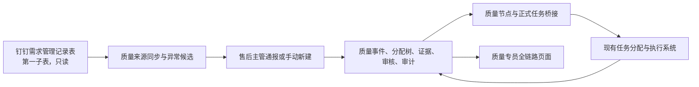

# 质量追踪第一期设计规格 v0.3

> 文档定位：质量追踪第一期的业务与系统设计基线。
> 确认状态：各设计章节及本书面版本已在 2026-07-13 经用户确认无误。
> 开发状态：尚未授权开发；当前只允许维护本文与页面模型图。
> 适用项目：`manage_robot` 当前版本。
> 旧计划处理：现有 `docs/superpowers/plans/` 下的 v0.2/P1 文档保留为历史快照，与本文冲突时不得作为实施依据；用户审阅本文后重新编写开发计划。

---

## 1. 目标与边界

### 1.1 第一期目标

第一期聚焦“质量异常事件追踪”：售后主管从需求管理记录表发现并通报质量异常，质量专员分配主责，部门通过现有任务系统递归执行和逐级验收，质量专员查看全链路并最终闭环。

系统必须同时解决四件事：

1. 让售后主管更容易从历史问题记录中发现重复或高风险问题。
2. 让质量异常从通报开始就有来源、责任、期限、证据和审计。
3. 复用现有任务分配页面，避免重新建设一套部门执行系统。
4. 让质量专员看到跨部门分配、执行、退回和证据的完整链路。

### 1.2 明确边界

- 新增独立“质量追踪”页面，不重做现有主管任务页面。
- 质量追踪采用角色权限控制，配置为售后主管或质量专员后始终显示入口，不以“默认关闭”作为上线方式。
- 主责部门负责人、协同部门负责人和普通执行人不显示“质量追踪”入口，只在现有任务页面看到分给自己的质量任务。
- 钉钉需求管理记录表只读，系统不回写、不删除、不修改原表。
- 质量事件、分配链、证据、审核、私密评论使用独立领域数据；现有任务系统继续负责承接人、执行状态、子期限和进度。
- 第一阶段不自动通报、不自动分配主责、不自动验收、不自动关闭。
- 第一阶段不开发绩效处罚、责任排名、正式 OA/ECR/ECN 审批或对外开放接口。

## 2. 总体架构

采用“独立质量领域层＋现有任务系统桥接”的方案：

### 2.1 数据边界

- 与现有工作台使用同一 SQLite 实例，但质量数据使用独立表。
- 质量事件是质量流程的权威源；现有任务和子任务是执行状态的权威源。
- 通过独立桥接表关联“质量分配节点”和“现有正式任务/子任务”，不把大量质量字段直接写进现有任务表。
- 质量模块失败或外部表格不可用时，现有任务功能不受影响。
- 所有关键写操作保留操作者、业务角色、时间、前后值、理由和请求标识。

### 2.2 概念数据表

| 数据单元 | 主要用途 |
|---|---|
| `quality_events` | 质量事件正文、状态、通报人、原主责、总期限和版本 |
| `quality_source_rows` | 钉钉第一子表的只读缓存、来源键、快照和版本摘要 |
| `quality_candidates` | 异常候选、触发原因、关联记录和售后判断结果 |
| `quality_event_source_links` | 一个事件关联一条或多条来源记录 |
| `quality_assignment_nodes` | 递归分配树、父节点、承接人、部门、期限和节点状态 |
| `quality_task_links` | 质量节点与现有任务/子任务的桥接关系 |
| `quality_evidence` | 节点证据文件、版本、上传人和保留状态 |
| `quality_node_reviews` | 直接上级、原主责和质量专员的验收记录 |
| `quality_private_threads/messages` | 质量专员与其下级的一对一私密评论 |
| `quality_audit_events` | 状态、权限、期限、更正、退回和配置审计 |
| `quality_notification_outbox` | 待发送、重试中、成功和失败的通知记录 |

## 3. 角色、入口与可见范围

### 3.1 角色定义

| 角色 | 页面入口 | 可见范围 | 核心职责 |
|---|---|---|---|
| 售后主管 | 始终显示“质量追踪” | 自己通报的事件及其公开全链路；需求记录来源区 | 发现、编辑草稿、通报、手动新建、补充证据和更正 |
| 质量专员 | 始终显示“质量追踪” | 全部质量事件、全部公开分配链和证据 | 分配原主责、干预链路、设置/变更总期限、指定节点退回、最终关闭 |
| 质量专员下级 | 显示受限“质量意见”入口 | 进行中事件的必要基础信息；仅自己的私密对话 | 就事件现状与质量专员进行一对一双向评论 |
| 原主责部门负责人 | 无质量追踪入口 | 现有任务页中的关联质量任务和必要背景 | 承接/驳回、递归分配、汇总全部分支并做总体确认 |
| 其他部门主管 | 无质量追踪入口 | 分给自己的任务分支和必要背景 | 承接/驳回、分给下属或其他部门主管、验收直接下级 |
| 普通执行人 | 无质量追踪入口 | 分给自己的任务和所需背景 | 执行、上传证据、提交完成 |

“质量专员”是角色权限，不硬编码姓名；当前业务人员为佟成。

### 3.2 权限规则

- 售后主管不能指定主责部门、替部门承接、验收部门任务或关闭事件。
- 质量专员能查看所有公开链路，但不替代部门直接上级完成常规逐级验收。
- 原主责负责人即使把全部任务分给其他部门，仍然保留最终主责身份。
- 任何主管只能操作自己承接的节点、自己的直接子节点和允许的验收动作。
- 页面隐藏不是权限边界；所有接口必须在服务端重复校验角色和事件范围。

## 4. 需求管理记录表接入

### 4.1 来源限定

- 来源文档：`https://alidocs.dingtalk.com/i/nodes/lo1YvX0prG98k9woqvrYVPw7xzbmLdEZ`
- 第一期只读取第一个子表“客户端问题反馈记录表”。
- 页面内展示只读同步表格，并提供“打开钉钉原表”。
- 生产同步不能依赖某个人浏览器中的登录状态；开发计划必须选择经企业授权的只读连接方式。

### 4.2 主要来源字段

页面优先展示并映射：反馈时间、反馈单号、反馈人员、设备型号、设备序列号、报损导管批次、问题描述、术者是否可以感知、对术者造成的影响、确认情况、责任人、导管是否寄回、问题归类、状态、解决工程师及方案、最终原因和解决措施、客服跟踪反馈。

当前记录中近期数据主要集中在反馈时间、反馈单号、设备、批次、问题描述和问题归类。因此异常发现不能依赖近期普遍缺失的责任人、处理状态或最终结论。

### 4.3 同步行为

- 每 2 小时自动同步一次，只读取第一子表。
- 售后主管可点击“立即同步”。
- 显示上次成功时间、当前同步状态和失败原因。
- 同步失败时继续使用上次成功缓存；手动新建和已有事件处理不受影响。
- 来源行变更或删除时保留事件创建时快照，显示“来源已更新/已删除”和差异，不静默覆盖已通报内容。
- 来源键优先使用反馈单号；缺失时使用反馈时间、反馈人、设备序列号和问题描述生成稳定摘要键。

## 5. 异常候选

### 5.1 识别方式

采用“明确规则＋相似历史记录”的组合，所有阈值做成可配置项：

1. 同一批次、相似问题在 30 天内出现至少 2 次。
2. 同一设备型号、同类问题在 30 天内出现至少 3 次。
3. 问题描述出现“断裂、无法使用、术中异常、无法成像”等可配置高风险词。
4. 与历史已确认质量事件或历史问题记录高度相似。
5. 日期错误、字段缺失等只进入“数据待完善”，不能仅凭数据质量问题生成质量候选。

### 5.2 人工决定

- 系统只生成“异常候选”，不自动创建质量事件。
- 每个候选必须显示触发规则、关联来源记录和相似历史记录。
- 售后主管可选择“通报质量异常”“暂不通报”或将多条来源记录合并为一次通报。
- “暂不通报”必须记录判断人、时间和原因，后续来源变化可重新触发候选。

## 6. 事件创建、编辑与防重复

### 6.1 两种创建入口

1. **从记录通报**：在来源记录或异常候选中点击“通报质量异常”，进入可编辑草稿；可选择多条来源记录合并通报。
2. **手动新建**：售后主管点击页面右上角“新建质量异常”，不依赖钉钉表格创建草稿。

### 6.2 草稿字段

至少包含：事件标题、问题现状、发生/反馈时间、反馈人、设备型号和序列号、导管批次、术者感知、现场影响、初步分类、紧急程度、来源记录、相似历史记录、附件和补充说明。

- 来源字段预填后允许售后主管编辑事件草稿，但原始来源快照始终只读保留。
- 草稿仅创建人可见，可以保存、继续编辑或删除。
- 提交后进入质量专员待分配队列。
- 提交后仍可补充说明和证据；修改原通报正文使用“更正通报”，保留修改前后内容、原因和时间，禁止无痕覆盖。

### 6.3 防重复

- 同一来源记录无论关联事件处于进行中还是已关闭，都不能再次直接通报；页面跳转到已有事件。
- 新来源记录与进行中事件相似时，售后主管可“加入已有事件”或“新建独立事件”。
- 手动新建命中相似事件时先提示；仍要独立创建必须填写原因。
- 第一期不合并两个已经存在的质量事件，只建立“相关事件”关系，避免破坏既有分配链、证据和审计。
- 新发生的相似问题可创建新事件并关联已关闭历史事件。

## 7. 状态流转

| 状态 | 进入方式 | 允许的核心动作 |
|---|---|---|
| 草稿 `DRAFT` | 售后主管开始创建 | 编辑、删除、提交 |
| 待质量专员分配 `PENDING_ASSIGNMENT` | 售后主管提交 | 质量专员指定原主责、总期限和任务要求 |
| 待主管承接 `PENDING_ACCEPTANCE` | 质量专员完成分配 | 被分配主管承接或驳回 |
| 处理中 `IN_PROGRESS` | 原主责承接 | 递归分配、执行、上传证据、逐级验收、变更子期限 |
| 待原主责总体确认 `PENDING_PRIMARY_REVIEW` | 全部分支均完成并通过直接上级验收 | 原主责通过或退回具体分支 |
| 待质量专员终验 `PENDING_QUALITY_REVIEW` | 原主责总体通过 | 质量专员最终关闭或指定节点退回 |
| 已关闭 `CLOSED` | 质量专员最终通过 | 只读查询；质量专员可填写原因后重开 |

共同规则：

- 主管驳回首次承接后，事件回到质量专员待分配，不删除原分配记录。
- 任一节点被直接上级退回时，事件保持处理中，原证据保留并允许上传新版本。
- 质量专员指定节点退回时，只重开该节点及其受影响上游验收，并通知原主责。
- 已关闭事件只有质量专员可以重开，必须填写理由并保留审计。
- 客户端不能直接提交目标状态，只能提交业务动作，由服务端决定合法迁移。

## 8. 任务分配与期限

### 8.1 复用现有任务页面

- 质量专员分配后，在主管原有任务页面的“待我承接”区域显示带有“质量任务”标识的任务。
- 主管可以查看必要的质量事件背景，但不会获得独立质量追踪入口。
- 现有任务系统继续负责承接人、任务状态、进度、催办和子任务期限；质量领域只保存质量节点和桥接关系。

### 8.2 递归分配

- 承接任务的主管既可分给自己的下属，也可分给其他部门主管。
- 其他部门主管承接后可以继续按同样规则分配，形成任意合理深度的分配树。
- 系统禁止把任务分回当前节点的祖先，避免形成循环。
- 所有分配人、承接人、部门、时间、期限、状态和操作历史都对质量专员可见。
- 原主责部门负责人始终保留事件总体责任，不因跨部门分配而转移。

### 8.3 期限规则

- 质量专员设置并可变更事件总期限，变更必须填写原因。
- 每个主管可以设置直接子节点期限，但不能晚于自己的节点期限。
- 主管只能调整自己的直接子节点期限；不得越级修改其他分支。
- 所有期限变更保留前后值、操作者、时间和理由。

## 9. 证据、验收与闭环

### 9.1 节点证据

- 每个执行节点提交完成时必须至少上传一份证据文件；上传失败时不能标记完成。
- 证据属于产生它的质量节点，记录上传人、时间、文件摘要和版本。
- 节点被退回后，历史证据不删除，新证据作为新版本追加。

### 9.2 逐级验收

1. 执行人完成并上传证据。
2. 直接上级验收该节点；不合格则退回该节点。
3. 验收通过的证据继续保留在事件链上，并向上汇总。
4. 所有分支通过后，原主责负责人查看完整证据包并做总体确认。
5. 原主责通过后，完整链路和证据提交质量专员。
6. 质量专员可以最终关闭，或指定任意具体节点退回整改。

售后主管可查看自己通报事件的公开链路和结果、补充说明及证据，但不参与部门验收和最终关闭。

## 10. 私密双向评论

- 质量专员的已配置下级拥有受限“质量意见”入口。
- 下级可选择具体质量事件，就当前现状向质量专员评论；质量专员可以在同一对话回复。
- 每条对话严格限定为“该评论人＋质量专员”双方可见。
- 其他下级、售后主管、部门主管、执行人和管理员业务页面均不能查看该私密内容。
- 不需要邀请、审批或逐事件授权；角色配置生效后即可使用。
- 私密评论不进入公开任务链、不改变事件状态、不作为正式验收证据；如需转为公开信息，由质量专员另行在公开链路补充并留痕。

## 11. 通知

复用现有工作台待办、钉钉工作通知和机器人单聊能力。质量页面同时保留通知记录。

| 触发动作 | 必须通知 |
|---|---|
| 售后主管提交事件 | 质量专员 |
| 质量专员分配原主责 | 原主责主管 |
| 主管继续分配 | 直接承接人 |
| 承接人驳回、阻塞或逾期 | 直接上级、原主责主管、质量专员 |
| 普通节点提交/退回证据 | 该节点双方；质量专员仅在全链路查看，不逐条推送 |
| 原主责总体通过 | 质量专员 |
| 质量专员关闭或指定节点退回 | 售后主管、原主责主管、被退回节点负责人 |
| 私密评论 | 评论双方 |
| 截止前一天 | 直接承接人 |
| 逾期 | 直接上级、原主责主管 |

- 通知发送失败不回滚已经成功的业务动作。
- 失败通知写入持久化队列并自动重试；达到上限后在页面显示人工处理状态。
- 同一事件、动作、接收人和提醒周期必须去重，避免重复轰炸。

## 12. 页面规格

### 12.1 售后主管质量追踪页

必须包含：

- 页面右上角“新建质量异常”。
- 今日新增、待判断、重复问题等关键数量。
- “需求管理记录表 · 客户端问题反馈记录表”第一子表只读区域。
- 上次同步时间、每 2 小时同步说明、“立即同步”和“打开钉钉原表”。
- “异常候选、全部反馈、已通报”三个范围。
- 来源记录表格、候选触发原因、相似历史记录、加入已有事件和通报操作。
- “我通报的事件”及状态、原主责、总期限、最新公开动作。

### 12.2 主管现有任务页

- 继续保留原任务工作台布局。
- “待我承接”区域显示质量任务标识、事件摘要、来源质量专员、原主责和期限。
- 支持承接、驳回、查看必要背景、分给下属、分给其他部门主管、设置子期限和验收直接子节点。
- 不增加“质量追踪”导航。

### 12.3 质量专员质量追踪页

- 事件列表：待分配、待承接、处理中、待原主责确认、待终验、已关闭。
- 事件详情：原始通报、来源快照、相关事件、原主责、总期限、完整递归分配树、每节点任务和证据、验收记录、通知和公开审计。
- 允许动作：分配原主责、变更总期限、查看全部证据、指定节点退回、最终通过并关闭、填写原因重开。
- 私密评论区按评论人分开，任何两个下级之间不能互相看到对话。

### 12.4 质量意见页

- 只显示进行中事件的必要基础信息和当前公开状态。
- 每位质量专员下级只能查看自己与质量专员的对话。
- 不显示分配、期限、证据验收、关闭或其他下级评论。

## 13. 异常、并发与安全

| 场景 | 处理方式 |
|---|---|
| 钉钉同步失败 | 使用最近成功缓存，显示失败和时间；允许手动新建 |
| 来源记录修改/删除 | 保留事件快照，显示来源差异，不覆盖通报正文 |
| 多人并发修改 | 使用版本校验；旧版本提交失败，刷新后重新确认 |
| 证据上传失败 | 保留表单和已成功文件，支持重试；禁止完成节点 |
| 通知失败 | 业务不回滚，持久化重试并审计 |
| 形成分配循环 | 服务端拒绝并审计 |
| 子期限超过父期限 | 服务端拒绝并提示允许上限 |
| 越权读取/操作 | 服务端拒绝，不泄露私密评论或超出范围的事件数据 |

安全要求：

- 复用现有工作台会话与钉钉免登。
- 文件上传、下载和预览均鉴权；存储名不直接使用用户原始文件名。
- 日志不记录附件正文、完整私密评论或钉钉密钥。
- 审计记录没有业务页面删除入口。
- 私密评论查询必须同时校验事件、评论人和质量专员三项关系。

## 14. 验收标准

### 14.1 角色与页面

- 售后主管和质量专员始终看到质量追踪入口。
- 普通主管只在原任务页面看到分给自己的质量任务。
- 质量专员下级只看到受限质量意见页。
- 任意角色伪造接口请求都不能越权读取或操作。

### 14.2 来源、候选和创建

- 只同步钉钉第一子表，每 2 小时自动同步，支持立即同步和失败缓存。
- 候选规则能解释触发原因，不能自动创建事件。
- 来源通报和手动新建都能保存可编辑草稿。
- 提交后正文更正保留前后内容和原因。
- 同一来源记录不能重复通报；相似记录可以加入已有事件或说明原因后新建。

### 14.3 分配与证据

- 原主责或任意承接主管能分给自己的下属或其他部门主管。
- 循环分配被阻止；原主责始终保留；质量专员看到完整链路。
- 子期限不能超过父期限，所有变更留痕。
- 每个完成节点都有证据，直接上级逐级验收，历史证据不因退回删除。
- 原主责只需验收整体证据包，通过后提交质量专员。
- 质量专员能关闭或指定节点退回，退回时原主责被通知。

### 14.4 私密评论、通知与回归

- 私密评论只有评论双方可见，不进入公开链路。
- 关键节点按本文矩阵通知；通知失败不影响业务并可重试。
- 质量模块相关测试覆盖权限、状态、并发、期限、递归分配、证据、隐私、同步和防重复。
- 现有任务页面、任务发布、承接、催办和其他工作台功能通过完整回归测试。

## 15. 开发前置条件与下一步

本文书面版本已经用户审阅确认，可以编写新的开发计划。开发计划必须：

1. 以本文 v0.3 为唯一业务基线，不复用旧计划中的售后终审、30 分钟同步、默认关闭、AI 强制复判等已被否定设计。
2. 先验证钉钉第一子表的企业授权只读连接方式，再确定同步实现；不能把人工登录浏览器作为生产方案。
3. 将质量领域与现有任务核心隔离，通过桥接表和现有服务接口集成。
4. 分阶段实施并设置回归门槛，任何阶段都不能破坏现有工作台。
5. 在用户再次明确授权开发前，不修改业务代码。
