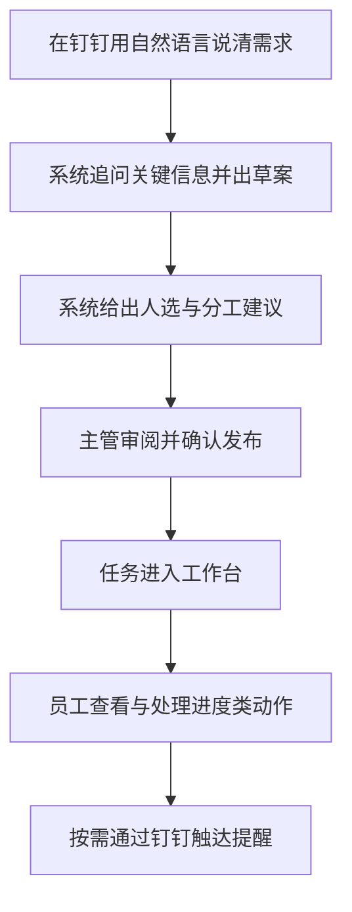
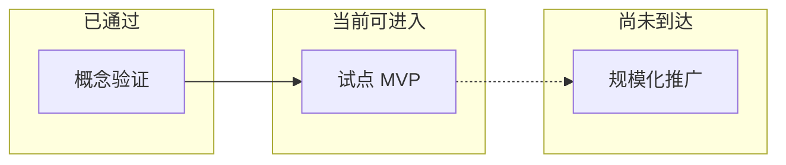

# 钉钉任务规划与承接确认机器人 — 阶段进展（管理层版）

| 项目 | 内容 |
|:---|:---|
| **汇报日期** | 2026-05-15 |
| **文档用途** | 向管理层同步：做到哪一步、能支撑什么业务、还缺什么、需要什么支持（不涉及技术实现） |

---

## 阅读导航（约 2 分钟抓重点）

| 章节 | 您最可能关心 |
|:---:|:---|
| [1. 一页纸结论](#1-一页纸结论) | 现在什么阶段、能干什么、不能干什么 |
| [2. 主流程怎么走](#2-主流程怎么走) | 从钉钉到工作台的示意图 |
| [3. 业务背景](#3-业务背景) | 解决哪类痛点 |
| [4. 各方已经能感知到什么](#4-各方已经能感知到什么) | 主管 / 员工 / 合规，各一行对照 |
| [5. 阶段台阶](#5-阶段台阶) | 离「可推广」还有多远 |
| [6. 本期明确不做](#6-本期明确不做) | 对外沟通时避免承诺过头 |
| [7. 后续方向](#7-后续方向) | 下一波大致往哪走（不定排期） |
| [8. 风险与依赖](#8-风险与依赖) | 需要组织侧一起兜底的点 |
| [9. 提请拍板](#9-提请拍板) | 会上可勾选的决策清单 |
| [10. 内部参考](#10-内部参考) | 技术细节文档入口 |

---

## 1. 一页纸结论

### 1.1 三行速览

| # | 问题 | 回答 |
|:---:|:---|:---|
| 1 | **我们在哪？** | **「可演示、可小范围试用」的 MVP**：钉钉里描述需求 → 系统辅助出 **可审阅草案** 与 **分工建议** → 主管确认后 **正式发布** → 员工在 **网页工作台** 处理，并可配合钉钉 **提醒**（以实际上线配置为准）。 |
| 2 | **还没到哪？** | **全流程无纸化闭环**：员工 **正式接受 / 要求修改 / 拒绝** 的规范闭环、执行中 **节点汇报与验收**、与 **OA / 质量系统** 的深度联动等，仍在后续规划中。 |
| 3 | **管理上怎么用？** | 适合 **限定人群、限定场景试点**；规模化前需再定范围、制度与下一期优先级（见 [9. 提请拍板](#9-提请拍板)）。 |

### 1.2 阶段一句话

> **试点条件已具备；全面推广条件尚未具备。**  
> 试点请带「成功标准」和「对外话术边界」（见第 6、9 节）。

---

## 2. 主流程怎么走

下面是一条「理想主路径」的示意，便于和业务方对齐口径（异常分支在试点方案中单列即可）。

**读图提示**：C、G 的效果与组织配置、试点策略有关；D 之前均可反复修改草案，避免「一锤定音」压力过早给到执行侧。

---

## 3. 业务背景

| 痛点 | 本产品方向 |
|:---|:---|
| 口头需求模糊，拆解与标准不一致 | 把模糊描述整理成 **结构清晰、可分工** 的任务说明，便于对齐预期 |
| 谁来做、怎么分，依赖个人经验 | 结合组织内人员信息，给出 **可参考的分工建议**（最终以主管确认为准） |
| 发布后执行过程难追踪 | 正式任务进入工作台，支撑 **查看、进度类动作与通知**（能力随版本扩展） |

---

## 4. 各方已经能感知到什么

| 角色 | 现在已经可以 | 试点时建议交代一句 |
|:---|:---|:---|
| **主管 / 发起人** | 钉钉里补充信息；看到 **草案 + 表格化呈现**；看到 **分工建议**；确认后 **发布正式任务** | 分工建议是 **辅助决策**，发布前请仍按本部门惯例把关质量与资源 |
| **员工** | 在工作台查看被指派的任务；做与当前版本匹配的 **状态类操作**；在开启相关能力时收到钉钉 **消息或待办** | 与「正式承接三态」相关的体验 **仍在路线图中**，避免与 OA 承诺混为一谈 |
| **组织 / 合规** | 设计上预留 **脱敏、访问控制、操作留痕** 等空间 | 实际上线策略（保留多久、谁可看）需 **管理规则与运维策略** 配套 |

---

## 5. 阶段台阶

| 阶段 | 含义 | 当前判断 |
|:---:|:---|:---|
| 概念验证 | 仅有演示、无真实日常入口 | **已通过** |
| 试点 MVP | 真实钉钉入口 + 草案 + 发布 + 工作台主流程 | **基本具备**，建议 **限定人群 / 限定场景** |
| 规模化推广 | 承接规则完备、异常路径清晰、与制度与周边系统衔接 | **尚未达到**，需业务与产品共同定义下一期范围 |

---

## 6. 本期明确不做

对外沟通时，建议 **原样或缩写** 使用右列话术，避免一线预期与系统能力错位。

| 不做 / 不自动闭环 | 对外可这样说（示例） |
|:---|:---|
| 不代替 **QMS/CAPA 结案** 或 **责任裁定** | 本系统管 **协作与任务状态**，不管体系结案结论 |
| 不承诺 **电子签章**、**复杂审批自动串联 OA** | 可作为 **后续集成专项** 单独立项与评估 |
| **员工确认承接** 的完整三态（接受 / 修改 / 拒绝）尚未产品化 | 当前以 **发布与执行侧可用能力** 为主；规范「接不接」的路径在 **下一期** |

---

## 7. 后续方向

| 方向 | 业务上多解决一件事 | 通常需要谁一起 |
|:---|:---|:---|
| 承接与协商闭环 | 「接不接、怎么改」有标准路径与记录 | 业务制度 + 产品 |
| 执行与验收 | 节点反馈、完成确认、超时与升级规则 | 业务 + 项目管理习惯 |
| 与现有体系衔接 | OA / 项目 / 质量系统数据互通范围定型 | IT + 对应系统 owner |
| 数据与权限治理 | 谁可发起、谁可发布、日志保留与审计 | 管理 + 安全 / 合规 |
| 人选建议可信度 | 从演示数据过渡到真实人事或能力标签 | HR 政策 + 数据授权 |

---

## 8. 风险与依赖

| 类型 | 可能现象 | 建议兜底 |
|:---|:---|:---|
| **智能服务依赖** | 草案质量、速度、成本随服务策略波动 | 变更前安排 **业务抽样验收**；保留人工修订入口 |
| **钉钉与云环境依赖** | 消息、通讯录、通知偶发不可用 | 约定 **人工渠道**（如群同步）与应急联系人 |
| **制度与流程依赖** | 系统无法自动解决「谁说了算」 | 试点前对齐 **发起范围、发布权限、争议升级路径** |

---

## 9. 提请拍板

会上可直接当 **任务清单** 用（复制到会议纪要即可）。

- [ ] **试点范围**：是否同意在指定部门/人群试用？试用周期？
- [ ] **成功标准**：是否采纳草案比例、发布任务量、投诉/回滚次数等 **量化门槛**？
- [ ] **下一期优先级**：资源有限时，优先 **承接三态**、**执行与验收**，还是 **系统集成**？
- [ ] **数据与权限**：发起人是否白名单、日志保留周期、是否对接正式人事数据？
- [ ] **对外话术**：是否统一以 **第 6 节「本期明确不做」** 为对外边界？

---

## 10. 内部参考

产品需求、部署说明与实现边界由项目组维护在 `docs/` 与 `AGENTS.md`。**管理层汇报以本文为准**；技术评审请使用对应技术文档。

---

*下次汇报请更新文首日期，并勾选 / 刷新第 9 节清单状态。*
